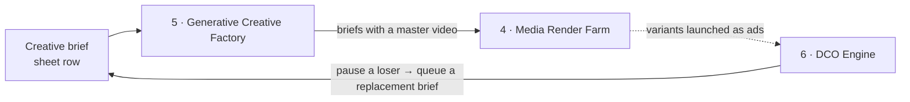

# ⚡ n8n Workflow Automation Portfolio: Production Patterns, Not Tutorials

[](#-the-n8n-workflows)
[](./scripts/lint_workflows.py)
[](./run_tests.py)
[](./LICENSE)

> **Ida Bagus Wicitra Dyaksa (Dyaksa): n8n & AI Workflow Automation Engineer.** I build event-driven n8n workflows that connect REST APIs, webhooks, databases and AI services, and I extend n8n with JavaScript Code Nodes and Python/Bash services where the built-in nodes stop. Every workflow here validates its input, verifies its own output, routes failures to an Error Trigger, and self-heals before it pages a human.

**7 importable n8n workflows · 126 nodes · 3 companion Python projects · 223 tests · a linter for the workflow JSON.** `py run_tests.py` runs all of it, with nothing to install.

---

## 🧭 The Thread Running Through All of It

Connecting app A to app B is the easy part, and it's not what breaks at 3am. Everything here is built around the branch where something goes wrong: the payload is malformed, the API is rate-limited, the GPU queue is wedged, the render is a 0-byte file, the backup "succeeded" and is empty, or the winning ad is sampling noise.

Four rules the whole repo follows:

1. **Exit code 0 is not evidence that a job did its work.** Every stage verifies its own output: `ffprobe` the render, checksum the archive, assert row counts after the load.
2. **Every workflow has a defined failure path and an Error Trigger.** A workflow that fails silently is worse than no workflow.
3. **Refusing to act is a feature.** Two workflows deliberately do nothing when the evidence is thin.
4. **A claim you can't check is not evidence.** The OAuth2/rate-limit logic has tests, the observability has an endpoint you can curl, and the ROI numbers are regenerated from raw data by a script.

---

## 🔧 The n8n Workflows

Each folder holds a `workflow.json` you can import straight into n8n, plus a README built on the same template: business impact, Mermaid architecture, technical highlights, env vars, import steps, and an edge-case table.

| # | Workflow | What it does | Key n8n mechanics |
|---|---|---|---|
| 1 | **[Lead Intake & CRM Sync](./project-1-lead-intake-crm-sync)** | Any form → normalized, de-duplicated CRM row → Slack alert + prospect auto-reply, with a synchronous 200/400 response | Webhook + Respond to Webhook, Code Node normalization, idempotent upsert, *Always Output Data* |
| 2 | **[Invoice Intake & Validation](./project-2-invoice-processing-pipeline)** | IMAP → PDF text → regex field parser → auto-approve / manager approval / human review | IMAP trigger, Extract From File, confidence gating, policy-as-one-parameter |
| 3 | **[Uptime Monitor & Auto-Remediation](./project-3-uptime-monitor-auto-remediation)** | 5-minute health checks → `docker restart` → verify → self-heal notice or on-call escalation | Full-response HTTP with *Never Error*, *On Error → Continue*, Wait, tiered Slack |
| 4 | **[Media Render Farm (FFmpeg)](./project-4-media-render-farm)** | One master video → every format × hook, rendered serially and `ffprobe`-verified before release | Async 202 ack, Split In Batches loop, Execute Command, binary multipart upload with retry |
| 5 | **[Generative Creative Factory (ComfyUI)](./project-5-generative-creative-factory)** | Spreadsheet brief → ComfyUI graph built in a Code Node → async polling with a hard give-up → placements | Programmatic API payloads, Wait-based polling loop, workflow-to-workflow webhooks |
| 6 | **[DCO Engine](./project-6-dco-engine)** | Paginated ad + affiliate pulls → per-variant metrics → Bonferroni-corrected test → scale / pause / hold | HTTP pagination, retries ×4, Merge, Switch, capped budget mutations |
| 7 | **[VPS Ops & Nightly Data Pipeline](./project-7-vps-ops-data-pipeline)** | JSON-over-SSH healthcheck → self-heal → verified backup → idempotent ETL → SQL data-quality gate | SSH, Postgres, gated branches, quarantine instead of commit |

### Companion projects: the code behind the nodes

| # | Project | Why it's here | Tests |
|---|---|---|---|
| 8 | **[Integration Kit](./project-8-integration-kit)** | What an n8n node does for you, with the node removed: OAuth2 single-flight refresh, HMAC webhooks with replay window, cursor pagination with loop guards, `Retry-After` + jittered backoff. It's the service a workflow calls through an HTTP Request node when no built-in node fits. | 83 |
| 9 | **[Observability Layer](./project-9-observability-layer)** | Correlation IDs across workflow hops, a Prometheus exporter, 7 alert rules (including "this workflow silently stopped"), a Grafana dashboard and an on-call runbook for workflows 1–7. | 105 |
| 10 | **[ROI Case Study](./project-10-migration-case-study)** | Before/after impact of workflow 2, with every number regenerated from raw CSVs and tests that fail if the prose drifts from the data. **The dataset is synthetic**, and the README says so up front. | 35 |

---

## 🔗 They Connect to Each Other

Workflows 4, 5 and 6 form one loop, not three demos:



A paused creative writes a new row into the same sheet Workflow 5 reads at 06:00. The pipeline refills itself, and the human's job moves from exporting files and checking dashboards to deciding what's worth testing.

The companion projects wrap around the estate: **8** is the integration service a workflow can call over HTTP, **9** instruments workflows 1–7, and **10** measures workflow 2.

---

## 🧰 Skills Coverage

| Skill | Where | What demonstrates it |
|---|---|---|
| **n8n workflow design** | 1–7 | Seven workflows, each with explicit failure branches and an Error Trigger |
| **Webhooks (sync & async)** | 1, 4, 5 | 200/400 responses, 202 ack-then-process, workflow-to-workflow calls |
| **Custom code (JS Code Nodes)** | 1–7 | Normalization, regex extraction, metric roll-ups, programmatic API payloads |
| **REST APIs, pagination, retries** | 4, 5, 6 | HTTP Request pagination, node-level Retry On Fail, Bearer/API-key auth |
| **OAuth2, HMAC, rate limiting** | 8 | Single-flight refresh proved under 8 threads, replay window, `Retry-After` in both formats |
| **Loops & polling** | 4, 5 | Split In Batches with failure-continues, elapsed-time give-up on async jobs |
| **Databases** | 7, 12 | Postgres upserts, SQL DQ assertions, quarantine; Sheets as an operational store |
| **Generative AI** | 5 | ComfyUI / SDXL API graph built in code, async job polling |
| **Scripting (Python / Bash)** | 4–7 | Standalone scripts with JSON output and typed exit codes, called from Execute Command / SSH |
| **Docker & Linux ops** | 3, 7 | Container self-heal, verified volume backups, VPS healthcheck |
| **Observability & alerting** | 10 | Prometheus exposition, staleness alerts, correlation IDs, runbook |
| **Statistics & business impact** | 6, 12 | Two-proportion z-test with Bonferroni, Wilson intervals, payback modelling |

---

## 🚀 Run It Yourself

### Check everything, with nothing to install

```bash
git clone https://github.com/wicitradyaksa/automation-portfolio.git
cd automation-portfolio
py run_tests.py
```

```
  Integration Kit            ok      83 tests
  Observability Layer        ok     105 tests
  Migration Case Study       ok      35 tests
==============================================================
223 tests
All suites passed.

n8n workflow lint
  project-1-lead-intake-crm-sync                ok
  ...
  project-7-vps-ops-data-pipeline               ok
```

The [workflow linter](./scripts/lint_workflows.py) checks every `workflow.json` for dangling connections, `$('Node')` references to nodes that don't exist, `$json` reads straight after a node that replaces the item (the most common n8n data-flow bug), node versions with mismatched parameter shapes, JavaScript syntax errors in Code Nodes, and a missing Error Trigger.

### Run the n8n workflows

```bash
cp .env.example .env        # sheet IDs, API URLs, tokens
docker compose up -d        # http://localhost:5678, create the owner account on first visit
```

Then for each workflow:
1. **Workflows → Import from File** → that project's `workflow.json`.
2. Map the placeholder credentials (`… (demo)`) to your own Google Sheets / Slack / SMTP / IMAP / SSH / Postgres credentials.
3. Open **Workflow Settings → Error Workflow** and select the workflow itself, so its Error Trigger fires.

The compose file passes `.env` through as `$env.*`, re-enables `$env` access and the Execute Command node (both off by default in recent n8n releases), and mounts the scripts used by workflows 4–6.

### The scripts run standalone

```bash
# see the A/B engine hold a +40% "winner" that isn't significant yet
python3 project-6-dco-engine/scripts/ab_significance.py \
    --metric cvr --variants "$(cat project-6-dco-engine/fixtures/variants.json)"

# health-check whatever box you're on
bash project-7-vps-ops-data-pipeline/scripts/vps_healthcheck.sh

# the integration pipeline against fakes: expired token → refresh → rate-limited pull → signed webhook → dedupe
cd project-8-integration-kit && py -m integration_kit.sync --demo
```

---

## 🌐 Live Site

`index.html` at the repo root is the portfolio site. Enable **GitHub Pages** (Settings → Pages → Deploy from a branch → `main` → `/ (root)`) and it's live at `https://wicitradyaksa.github.io/automation-portfolio/`.

---

## 📁 Repo Structure

```
automation-portfolio/
├── index.html                    # portfolio site (GitHub Pages)
├── docker-compose.yml            # local n8n wired for these workflows
├── .env.example                  # every $env variable the workflows read
├── run_tests.py                  # 223 Python tests + the workflow linter
├── scripts/lint_workflows.py     # static checks for workflow.json exports
├── docs/phase1-n8n-positioning.md
├── project-1 … project-7/        # README.md + workflow.json (+ scripts/ where used)
├── project-8-integration-kit/    # OAuth2, HMAC webhooks, pagination, retries (83 tests)
├── project-9-observability-layer/  # exporter, alerts, dashboard, runbook (105 tests)
└── project-10-migration-case-study/ # ROI method, numbers from data (35 tests)
```

---

## ✅ Honest Status

* **Workflows 1–7** pass the linter and are written against current n8n node schemas, but they haven't yet been run end to end against live credentials. The first item below fixes that.
* **Impact figures** in the READMEs are tagged as a real result, a **(benchmark)** from Project 10's synthetic dataset, or a **(design target)**. Nothing untagged is invented.
* **Project 9's** Docker stack (Prometheus + Grafana) hasn't been started. The exporter itself is verified live.

## 🛣️ What's Next

- [ ] Run each workflow against a sandboxed Google Sheet + Slack workspace and record a 60-second Loom of each.
- [ ] Replace Project 10's synthetic data with two weeks of real timings.
- [ ] Add a reusable **retry sub-workflow + dead-letter table** (Execute Workflow + Postgres) and adopt it in workflows 1–7.
- [ ] Add an **OpenAI structured-extraction node with a confidence gate** to workflow 2, and LLM lead scoring to workflow 1.
- [ ] Wire workflows 1–7 into Project 9's exporter and publish a Grafana screenshot with real data.

---

## 📄 License

[MIT](./LICENSE). Use these workflows and scripts freely, including commercially.

## 📬 Contact

**Ida Bagus Wicitra Dyaksa (Dyaksa)** · [wicitradyaksa@gmail.com](mailto:wicitradyaksa@gmail.com) · [LinkedIn](https://www.linkedin.com/in/ida-bagus-wicitra-dyaksa-063458129/) · [GitHub](https://github.com/wicitradyaksa)

---
*Built with Claude's help as a working starting point. The architecture, failure handling and trade-offs are real, the tests pass, and every README says which claims are verified and which aren't. Read it, run it, and break it yourself before discussing it in an interview.*
