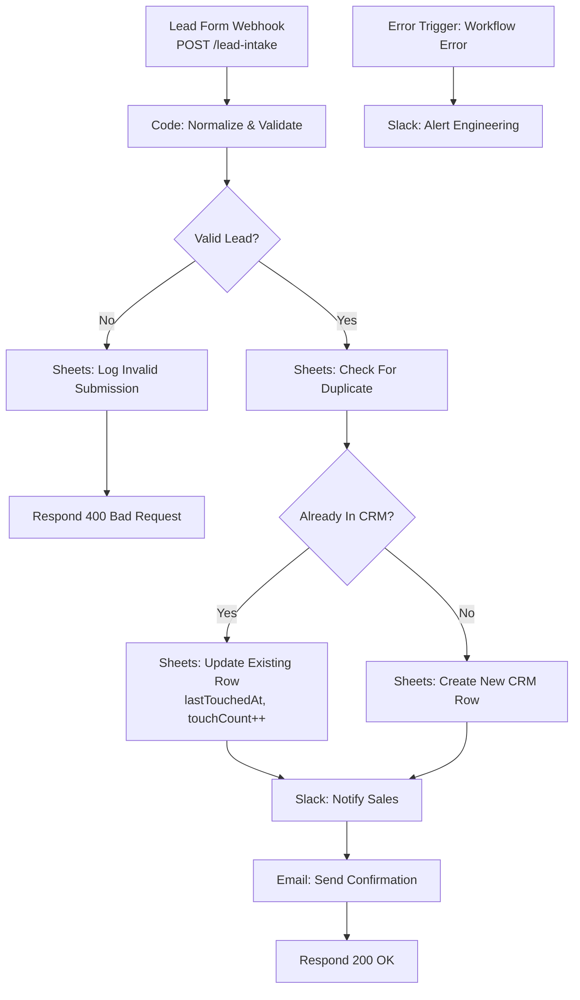

# ⚡ Lead Intake & CRM Sync: Every Lead Captured, De-Duplicated and Answered in One Execution

[](https://n8n.io)
[](./workflow.json)
[](#-key-technical-features)
[](../LICENSE)

> **Quick Summary:** An n8n webhook workflow that accepts leads from any form or partner API, normalizes inconsistent payloads in a JavaScript Code Node, de-duplicates against the CRM on email, upserts the record, pings sales in Slack, auto-replies to the prospect by email, and returns a synchronous JSON response to the form, all in a single execution.

---

## 📷 Workflow Preview

<!-- Add docs/images/workflow-screenshot.png after the first run with live credentials -->
*Download the ready-to-import n8n workflow file: [`workflow.json`](./workflow.json)*

---

## 🎯 Business Problem & Impact

* **The Challenge:** Small sales teams collect leads from several sources (website contact form, campaign landing pages, partner referrals) that use different field names and don't talk to each other. Someone checks multiple inboxes, copies rows into a CRM by hand, enters the same person twice, and sometimes forgets to reply for a day or two.
* **The Solution:** One webhook endpoint that every form POSTs to. It is event-driven, validates before anything touches the CRM, upserts idempotently on email, and alerts through an Error Trigger when the workflow itself fails.
* **Impact & ROI:**
  * **Speed-to-lead:** Goes from hours or days to **under 1 minute** from form submit to Slack alert plus prospect auto-reply *(design target: both fire in the same execution)*.
  * **Data accuracy:** **Every** submission is validated and de-duplicated before it is written. No duplicate contacts are created for a repeat email *(by construction)*.
  * **No silent loss:** **Every** outcome (new, duplicate, invalid, or failed execution) lands in a log or a Slack alert.
  * **Manual effort removed:** Inbox triage, copy-paste entry and "did anyone reply?" follow-up.

---

## 🏗️ Workflow Architecture



---

## ⚙️ Key Technical Features

* **Payload normalization in a Code Node:** `Normalize & Validate` maps field-name variants (`first_name` / `firstName`, etc.) to one schema, trims and lower-cases the email, and runs a regex check on the email before any write.
* **Idempotent upsert on a natural key:** Email is the de-duplication key. The lookup node has *Always Output Data* on, so a lead with no match still reaches the IF and takes the "create" branch instead of silently ending the run. A repeat submission updates `lastTouchedAt` and increments `touchCount` instead of creating a second contact.
* **Synchronous webhook contract:** `Respond to Webhook` returns `200` with JSON on success and `400` with the reason on invalid input, so the front-end form can show the right message.
* **Explicit data lineage:** Nodes after a Sheets or Slack call read the lead from `$('Normalize & Validate').item.json` rather than `$json`, because an API node's output is its *response*, not the lead.
* **Every branch ends in a log:** Valid, invalid, new and duplicate leads all land somewhere auditable. Invalid ones go to a `Rejected Submissions` sheet instead of disappearing.
* **Resilient error handling:** An **Error Trigger** catches any failed execution and posts it to `#eng-alerts`. A dropped lead that nobody notices is exactly the problem this workflow exists to prevent.
* **Credentials & security:** All credentials are held in the n8n credential store. The exported JSON contains only placeholder credential names (`… (demo)`) and no secrets.

---

## 🧠 Why It's Built This Way

* **Validation happens before anything touches the CRM.** Garbage-in, garbage-out is the #1 way an "automated" CRM loses trust. Once reps stop believing the data, they go back to spreadsheets.
* **De-duplicate by email, not by name.** Names collide, and email is the safer first-pass key. A production version would also fuzzy-match company + name for leads without an email, and route those to manual review instead of guessing.
* **The CRM is a Google Sheet on purpose.** The branching logic is what's being demonstrated. Swapping in HubSpot or Pipedrive nodes changes the sink, not the graph.

---

## 🔐 Prerequisites & Environment Variables

n8n v1.0+ (self-hosted via the repo-root [`docker-compose.yml`](../docker-compose.yml), or n8n Cloud).

| Credential (placeholder name in JSON) | Type | Used by |
| :--- | :--- | :--- |
| `Google Sheets - CRM (demo)` | Google Sheets OAuth2 | Check For Duplicate, Update/Create Row, Log Invalid Submission |
| `Slack - Sales Workspace (demo)` | Slack API (`chat:write`) | Notify Sales, Alert Engineering |
| `Transactional SMTP (demo)` | SMTP | Send Confirmation Email |
| `CRM_SHEET_ID` | Environment variable: the Google Sheet used as the CRM | All Sheets nodes |

The sheet needs a `Leads` tab (the CRM) and a `Rejected Submissions` tab. Columns: `email, firstName, lastName, company, source, createdAt, lastTouchedAt, touchCount`.

Environment variables reach the workflow as `$env.NAME` through the repo-root [`docker-compose.yml`](../docker-compose.yml) (`env_file: .env`, see [`.env.example`](../.env.example)), which also sets `N8N_BLOCK_ENV_ACCESS_IN_NODE=false`.

> **Error Trigger:** the workflow names itself as its error workflow (`settings.errorWorkflow`), so failures alert Slack out of the box. Importing through the editor can give the workflow a new ID. If so, open **Workflow Settings → Error Workflow** and select this workflow again (or a shared error-handler workflow).

---

## 🚀 Quick Start / How to Import

> **Full standalone installation guide:** [`SETUP.md`](./SETUP.md) covers every credential with its scopes, the sheet layout, a Docker setup for this workflow only, a node-by-node reference and test steps.

1. **Download** [`workflow.json`](./workflow.json).
2. **Import:** in the n8n canvas, open **`...` (Menu) → Import from File** and select `workflow.json`.
3. **Configure credentials:** open each node flagged ⚠️ and map it to your own Google Sheets, Slack and SMTP credentials.
4. **Activate** the workflow, then copy the production URL from **Lead Form Webhook** into your form's submit action.
5. **Test:**

```bash
curl -X POST https://<your-n8n-host>/webhook/lead-intake \
  -H "Content-Type: application/json" \
  -d '{"firstName":"Ada","lastName":"Lovelace","email":"ada@example.com","company":"Analytical Engines Ltd","source":"landing_page_q4"}'
```

Send the same payload twice. The second call should update `touchCount` instead of adding a row.

---

## 🧪 Edge Cases & Testing Strategy

| Scenario | Handled By | Outcome |
| :--- | :--- | :--- |
| Malformed or missing email | `Normalize & Validate` → `Valid Lead?` | Logged to `Rejected Submissions`, form receives `400` with the reason |
| Same person submits twice (or from two forms) | `Check For Duplicate` → `Already In CRM?` | Existing row updated (`touchCount++`), no duplicate contact |
| Field-name drift between forms | Code Node field mapping | Normalized to one schema before any write |
| Slack / SMTP / Sheets outage mid-run | **Error Trigger** → `Alert Engineering` | Engineering alerted with the failed execution; lead is recoverable from n8n execution history |

---

## 🛣️ Roadmap / v2 Hardening (not yet built)

* **Retry sub-workflow:** Wrap the Slack and SMTP calls in an **Execute Workflow** sub-workflow with exponential backoff, so a transient API hiccup doesn't need a manual re-run.
* **Dead-letter table:** Persist the raw payload of any failed execution to Postgres/Supabase, with a replay workflow.
* **Real CRM via OAuth2:** HubSpot or Pipedrive nodes with OAuth2 credentials, replacing the Google Sheets CRM.
* **LLM lead scoring:** An OpenAI node classifies intent and scores the lead before routing it to the right rep.
* **Spam protection:** CAPTCHA verification and per-IP rate limiting upstream of the webhook.

---

## 📄 License
Distributed under the [MIT License](../LICENSE).

[← Back to portfolio](../README.md)
