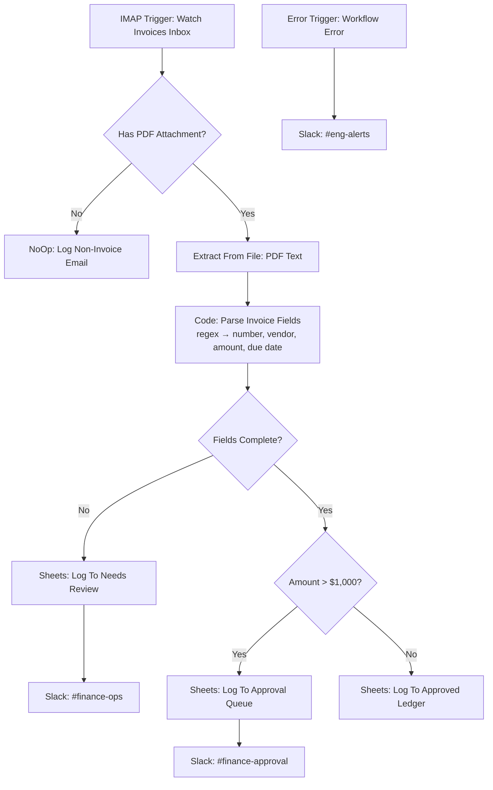

# ⚡ Invoice Intake & Validation Pipeline: From Inbox PDF to Routed Approval Without Anyone Typing

> **Quick Summary:** An n8n workflow that watches an accounts-payable inbox over IMAP, extracts text from invoice PDFs, parses invoice number, vendor, amount and due date in a JavaScript Code Node, and routes each invoice by rule. Incomplete parses go to human review, amounts over $1,000 go to manager approval, and the rest are logged as auto-approved. Every exception is announced in Slack.

---

## 📷 Workflow Preview

<!-- Add docs/images/workflow-screenshot.png after the first run with live credentials -->
*Download the ready-to-import n8n workflow file: [`workflow.json`](./workflow.json)*

---

## 🎯 Business Problem & Impact

* **The Challenge:** Someone in finance opens every email, reads each PDF, types six fields into a spreadsheet, checks totals by hand, and decides from memory who needs to approve. That's roughly **90 minutes for about 40 invoices, five days a week**. The expensive parts are transposition errors, duplicate payments, missed invoices and the month-end volume cliff.
* **The Solution:** An event-driven pipeline in which "couldn't parse it" is a first-class routed outcome rather than a crash or a guess. The approval policy lives in one IF node that finance can read.
* **Impact & ROI:** from the [Project 10 impact model](../project-10-migration-case-study). The method is real, but the dataset is synthetic until real timings are collected.
  * **Throughput:** **5.2× faster per invoice** (2.21 → 0.43 minutes) *(benchmark)*
  * **Latency:** median run **91 → 17 minutes** *(benchmark)*
  * **Error rate:** **1.56% → 0.63%** *(benchmark)*
  * **Time saved:** **7.4 hours/week** and **340 hours/year**, with a **4.6-week payback** on a 34-hour build *(benchmark)*

---

## 🏗️ Workflow Architecture

---

## ⚙️ Key Technical Features

* **Document parsing without a separate service:** `Extract From File` pulls raw PDF text, and a JavaScript Code Node applies four readable regex rules (invoice number, total, due date, vendor from the first line). You can audit them in 30 seconds.
* **Confidence gating:** The parser sets `complete = true` only when invoice number, amount *and* due date were all extracted. Anything less is routed to a person. The workflow never writes a half-filled row into the ledger.
* **Policy as a single parameter:** The approval threshold is one number in the `Needs Manager Approval?` IF node, so a policy change is a one-field edit.
* **Three-way routing to separate audit trails:** `Needs Review`, `Pending Approval` and `Invoice Ledger` are separate sheets, so each queue can be worked and audited on its own.
* **Resilient error handling:** The **Error Trigger** routes any failed execution to `#eng-alerts`.
* **Credentials & security:** IMAP, Sheets and Slack credentials live in the n8n credential store. The export carries placeholder names only.

---

## 🧠 Why It's Built This Way

* **The safe failure mode, always.** A pipeline that records wrong numbers when parsing fails is worse than one that flags its own uncertainty. Low confidence means a human looks at it.
* **Target the biggest step first.** Timing the manual process step by step showed about 55% of it was reading and typing six fields. That's why this workflow automates extraction rather than the approval emails that were more visibly annoying.
* **Aim for about 95%, not 100%.** Roughly 5% of invoices need genuine judgement. The automation's job is to hand the reviewer *only* those, not to guess at them.
* **The regex parser is deliberately swappable.** Replace `Parse Invoice Fields` with an LLM extraction node and every downstream node stays identical, because the contract is the same JSON shape.

---

## 🔐 Prerequisites & Environment Variables

n8n v1.0+.

| Credential (placeholder name in JSON) | Type | Used by |
| :--- | :--- | :--- |
| `Accounts Payable Inbox (demo)` | IMAP | Watch Invoices Inbox |
| `Google Sheets - Finance (demo)` | Google Sheets OAuth2 | Approval Queue, Approved Ledger, Needs Review |
| `Slack - Finance Workspace (demo)` | Slack API (`chat:write`) | Finance Manager, Finance Ops, Engineering alerts |
| `FINANCE_SHEET_ID` | Environment variable: the finance Google Sheet | All Sheets nodes |

Slack channels used: `#finance-approval`, `#finance-ops`, `#eng-alerts`.

Environment variables reach the workflow as `$env.NAME` through the repo-root [`docker-compose.yml`](../docker-compose.yml) (`env_file: .env`, see [`.env.example`](../.env.example)), which also sets `N8N_BLOCK_ENV_ACCESS_IN_NODE=false`.

> **Error Trigger:** the workflow names itself as its error workflow (`settings.errorWorkflow`), so failures alert Slack out of the box. Importing through the editor can give the workflow a new ID. If so, open **Workflow Settings → Error Workflow** and select this workflow again (or a shared error-handler workflow).

---

## 🚀 Quick Start / How to Import

> **Full standalone installation guide:** [`SETUP.md`](./SETUP.md) covers every credential with its scopes, the sheet layout, a Docker setup for this workflow only, a node-by-node reference and test steps.

1. **Download** [`workflow.json`](./workflow.json).
2. **Import:** open **`...` (Menu) → Import from File**.
3. **Configure credentials:** map your IMAP, Google Sheets and Slack credentials to the nodes flagged ⚠️.
4. **Set your policy:** change `1000` in **Needs Manager Approval?** to match your approval threshold.
5. **Activate**, then email yourself a sample invoice PDF containing `Invoice #INV-1042`, `Total Due: 1,240.50` and `Due Date: 30/09/2026`.

---

## 🧪 Edge Cases & Testing Strategy

| Scenario | Handled By | Outcome |
| :--- | :--- | :--- |
| Email with no PDF (reply, newsletter, image attachment) | `Has PDF Attachment?` (checks the attachment's MIME type) | Ignored via NoOp, nothing written |
| PDF where a required field can't be found | `Parse Invoice Fields` → `Fields Complete?` | Logged to `Needs Review` + `#finance-ops` ping. Never guessed |
| Amount above threshold | `Needs Manager Approval?` | Logged to `Pending Approval` + `#finance-approval` ping |
| Amount written with thousands separators (`1,240.50`) | Code Node normalizes (strips `,`) before `parseFloat` | Correct numeric comparison |
| IMAP / Sheets / Slack failure | **Error Trigger** → `#eng-alerts` | Engineering alerted with the failed execution |

---

## 🛣️ Roadmap / v2 Hardening (not yet built)

* **LLM extraction with a confidence gate:** An OpenAI / LangChain structured-output node returns fields *plus* a confidence score. Below the threshold, the invoice goes to `Needs Review` (same contract as today).
* **Vendor templates from a vector store:** Retrieve the closest known vendor layout (Supabase pgvector) as a few-shot example for the extractor.
* **Duplicate-invoice detection:** Block a second vendor + invoice-number pair before it reaches the ledger. This addresses the most expensive manual failure mode.
* **Audit archive:** Store the original PDF in Drive/S3, linked from the ledger row.
* **Retry sub-workflow + dead-letter table:** For transient Sheets/Slack failures, with payload preservation for replay.

---

## 📄 License
Distributed under the [MIT License](../LICENSE).

[← Back to portfolio](../README.md)
