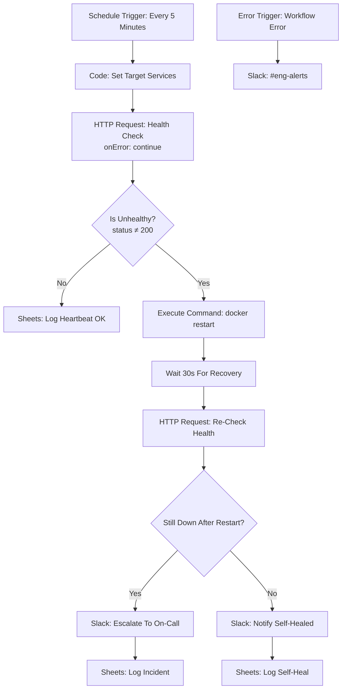

# ⚡ Uptime Monitor & Auto-Remediation: Restart It, Verify It, and Only Then Wake Someone Up

> **Quick Summary:** A scheduled n8n workflow that health-checks every registered service every 5 minutes. On failure it attempts a `docker restart`, waits 30 seconds, and re-checks. It posts a self-heal notice if that worked and escalates to on-call if it didn't. Every heartbeat, self-heal and incident is logged separately so uptime % and MTTR can be computed later.

---

## 📷 Workflow Preview

<!-- Add docs/images/workflow-screenshot.png after the first run with live credentials -->
*Download the ready-to-import n8n workflow file: [`workflow.json`](./workflow.json)*

---

## 🎯 Business Problem & Impact

* **The Challenge:** Basic uptime monitors tell you *that* something is down, not how to fix it. In small self-hosted teams, many incidents are simply "the container hung," which a restart fixes. Paging a human at 3am for that is expensive and wears people out.
* **The Solution:** A tiered response of detect → self-heal → verify → escalate. Remediation is always confirmed by a re-check, and it is never looped forever.
* **Impact & ROI:**
  * **Detection latency:** **≤ 5 minutes**, set by the schedule interval.
  * **Hung-container incidents:** Resolved in **about 30 seconds with zero pages** *(design target: restart + 30 s wait + re-check)*.
  * **Pager load:** On-call is paged **only after automated remediation has provably failed**.
  * **Reporting:** Heartbeats, self-heals and incidents are logged as distinct outcomes, so "12 self-heals, 1 real incident this month" can be reported instead of "13 pages".

---

## 🏗️ Workflow Architecture

---

## ⚙️ Key Technical Features

* **Service registry in one Code Node:** `Set Target Services` returns one item per service (`service`, `url`, `container`). To add or remove a service you edit one node, and n8n fans the rest of the workflow out per item.
* **Timeouts as data, not crashes:** Both health checks return the full response with *Never Error* on (so a 503 is data), and the node setting *On Error → Continue* turns a refused connection into an item with no `statusCode`, which the IF treats as `0`, meaning unhealthy.
* **Restart failures still escalate:** `Restart Container` also continues on error, so a failed `docker restart` flows into the re-check and pages on-call instead of stopping the workflow.
* **Verified remediation:** A restart is never reported as a fix until the `Re-Check Health` request confirms it.
* **Two different messages for two different situations:** A self-heal is an FYI post in `#incidents`. A failed self-heal is an escalation to on-call.
* **Resilient error handling:** The **Error Trigger** alerts `#eng-alerts` if the monitor itself breaks, because a silent monitor is worse than none.

---

## 🧠 Why It's Built This Way

* **Self-heal before escalate, but escalate.** It removes pages for a class of incident that doesn't need a human, without restart-looping a genuinely broken deployment.
* **Log every check, not just failures.** Without "OK" heartbeats you can't compute real uptime %, and you can't prove the monitor was running during a gap.
* **Keep outcomes distinct.** Self-heal and incident are separate log rows, which is what makes an MTTR report meaningful.

### ⚠️ Security note: read before running `Execute Command` for real
`docker restart` via **Execute Command** assumes n8n has shell access to the Docker host, which is a significant trust boundary. In production, run n8n with a narrowly scoped Docker socket proxy (e.g. `tecnativa/docker-socket-proxy` restricted to `POST /containers/{id}/restart`) and call it with an HTTP Request node, rather than mounting the full Docker socket.

---

## 🔐 Prerequisites & Environment Variables

n8n v1.0+, running on (or with scoped access to) the Docker host. See the repo-root [`docker-compose.yml`](../docker-compose.yml).

| Credential (placeholder name in JSON) | Type | Used by |
| :--- | :--- | :--- |
| `Google Sheets - Ops (demo)` | Google Sheets OAuth2 | Heartbeat, Incident and Self-Heal logs |
| `Slack - Ops Workspace (demo)` | Slack API (`chat:write`) | `#incidents`, `#eng-alerts` |
| `OPS_SHEET_ID` | Environment variable: the ops Google Sheet (`Uptime Log`, `Incidents` tabs) | All Sheets nodes |

**Note:** recent n8n releases disable the Execute Command node by default. The repo-root compose file re-enables it (`NODES_EXCLUDE=[]`). Alternatively, use the socket-proxy approach above.

Environment variables reach the workflow as `$env.NAME` through the repo-root [`docker-compose.yml`](../docker-compose.yml) (`env_file: .env`, see [`.env.example`](../.env.example)), which also sets `N8N_BLOCK_ENV_ACCESS_IN_NODE=false`.

> **Turn on the Error Trigger:** n8n only runs an Error Trigger for workflows that name it as their error workflow. After importing, open **Workflow Settings → Error Workflow** and select this workflow (or a shared error-handler workflow). Until you do, failures show in the execution list but don't alert Slack.

---

## 🚀 Quick Start / How to Import

1. `docker compose up -d` from the repo root.
2. **Import** [`workflow.json`](./workflow.json) via **`...` → Import from File**.
3. **Edit `Set Target Services`** with your real health URLs and container names.
4. **Map credentials** for Google Sheets and Slack, then **Activate**.
5. **Test the self-heal path:** `docker stop <container>` makes the health check fail. The restart should bring it back, and you should see a self-heal notice.

---

## 🧪 Edge Cases & Testing Strategy

| Scenario | Handled By | Outcome |
| :--- | :--- | :--- |
| Service returns non-200 | `Is Unhealthy?` | Restart → wait 30 s → re-check |
| Service unreachable / request times out | HTTP Request `onError: continueRegularOutput` | Treated as unhealthy, not a workflow crash |
| Restart fixes it | `Still Down After Restart?` = false | `#incidents` FYI + Self-Heal log row, no page |
| Restart doesn't fix it | `Still Down After Restart?` = true | On-call escalation + Incident log row |
| Monitor workflow itself fails | **Error Trigger** → `#eng-alerts` | Engineering alerted |

---

## 🛣️ Roadmap / v2 Hardening (not yet built)

* **Restart budget:** A max-restarts-per-hour guard with backoff, so a crash-looping service escalates quickly instead of being restarted repeatedly.
* **Scoped remediation:** Replace Execute Command with an HTTP Request to a Docker socket proxy.
* **Weekly SLO digest:** A sub-workflow that computes uptime % and MTTR from the logs and posts them to Slack.
* **Metrics export:** Emit run and incident events to the [Project 9](../project-9-observability-layer) Prometheus exporter.

---

## 📄 License
Distributed under the [MIT License](../LICENSE).

[← Back to portfolio](../README.md)
