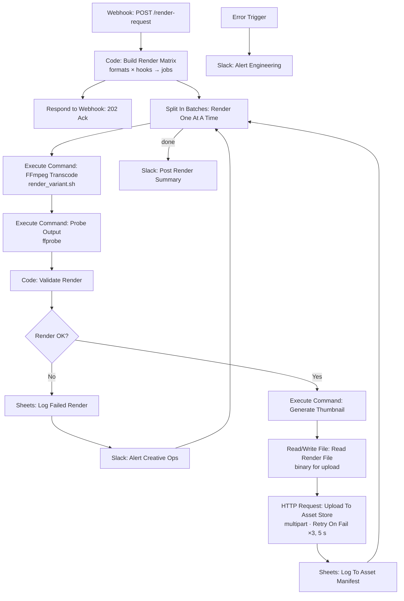

# ⚡ Media Render Farm (FFmpeg): One Master Video In, Every Ad Format Out, and Every Output Verified

[](https://n8n.io)
[](./workflow.json)
[](./scripts/render_variant.sh)
[](../LICENSE)

> **Quick Summary:** An n8n webhook workflow that expands one render request (master file × formats × hooks) into a matrix of jobs, returns `202 Accepted` right away, and transcodes the jobs **serially** through FFmpeg. It `ffprobe`s every output against the requested spec, rejects anything that doesn't match, uploads the rest to an asset store with retries, and writes a manifest that the [DCO Engine](../project-6-dco-engine) tests against.

---

## 📷 Workflow Preview

<!-- Add docs/images/workflow-screenshot.png after the first run with live credentials -->
*Download the ready-to-import n8n workflow file: [`workflow.json`](./workflow.json)*

---

## 🎯 Business Problem & Impact

* **The Challenge:** One performance-marketing concept needs 12–16 files (4 placements × 3–4 opening hooks), refreshed every couple of weeks. Exporting them by hand takes an afternoon, and the exports are inconsistent: the wrong loudness, non-square pixels that get rejected on upload, a missing faststart flag. Worst of all, some renders only *look* successful. FFmpeg exits 0, and the file is 4 KB and zero seconds long.
* **The Solution:** An asynchronous render queue in which "done" means "verified against spec", not "the encoder exited 0".
* **Impact & ROI:**
  * **Throughput:** **1 API request → up to 16 variants**, replacing an afternoon of manual exporting *(design target)*.
  * **Quality gate:** **0 unverified files reach the asset manifest**. Duration, byte size, width and height are asserted on every output *(enforced by `Validate Render`)*.
  * **Caller latency:** The webhook acknowledges with **202 immediately**, so no client holds a connection open for a multi-minute batch.
  * **Resilience:** One failed variant is logged and alerted, and **the other variants keep rendering**.

---

## 🏗️ Workflow Architecture



---

## ⚙️ Key Technical Features

* **Job-matrix expansion in a Code Node:** `Build Render Matrix` turns `{formats: [...], hooks: [...]}` into one item per variant, with target dimensions and output paths.
* **Async webhook pattern:** `Respond to Webhook` returns `202` with the queued count before rendering starts.
* **Deliberate serial processing:** `Split In Batches` with `batchSize: 1` means one FFmpeg process at a time. Six concurrent x264 encodes on a 2-core VPS don't finish six times faster. They thrash, and the n8n UI stops responding.
* **Output verification, not exit-code trust:** `Validate Render` compares `ffprobe` output to the requested spec:

  | Check | Catches |
  |---|---|
  | `duration < 1s` | Truncated source, bad seek, corrupt input |
  | `bytes < 10 KB` | Encoder wrote a header and nothing else |
  | `width != requested` | Filter chain silently fell back |
  | `height != requested` | Pad/scale math wrong for an unusual source ratio |

* **Failures become data, not crashes:** `FFmpeg Transcode` and `Probe Output` continue on error, so a non-zero exit reaches `Validate Render` as an empty probe and is logged as a failed variant instead of aborting the batch.
* **Real file upload:** `Read Render File` loads the MP4 as binary, and the HTTP Request sends it as `multipart/form-data` with node-level **Retry On Fail (3 tries, 5 s apart)**.
* **Explicit data lineage:** Nodes after a shell or API call read the variant spec from `$('Validate Render').item.json`, because an Execute Command node's output is `stdout`, not the job.
* **One summary per batch:** `Post Render Summary` runs once (*Execute Once*), not once per variant.
* **Secrets from the environment:** `ASSET_STORE_URL` and `ASSET_STORE_TOKEN` are read via `$env`, so they are never stored in node parameters that appear in execution logs.
* **Resilient error handling:** A variant that fails validation takes the failure branch and the loop continues. An unexpected crash goes to the **Error Trigger**.

### The FFmpeg script: [`scripts/render_variant.sh`](./scripts/render_variant.sh)
The encode lives in a script rather than a node, so it can be reviewed and tested on its own:

* `scale=…:force_original_aspect_ratio=decrease` then `pad=`: fit and letterbox, never stretch.
* `setsar=1`: square pixels. A non-1 SAR is a common silent upload rejection.
* `loudnorm=I=-14:TP=-1.5`: every variant is equally loud, so a hook test isn't secretly a volume test.
* `-movflags +faststart`: playback can start before the download finishes.
* **Atomic writes:** it renders to `.partial` and then `mv`s into place, so a crash leaves nothing rather than a half-file.
* **Typed exit codes:** `set -Eeuo pipefail`, then `2` bad args, `3` missing source, `4` encoder failed, `5` output too small. The workflow knows *how* a render failed.

---

## 🧠 Why It's Built This Way

* **Serial, not parallel.** Throughput is CPU-bound, so queuing is the correct design, not a limitation.
* **Ack first.** A client timeout can't knock over a multi-minute batch.
* **Failures continue the loop.** One bad hook doesn't abandon the other eleven variants.
* **A bug it caught:** the temp file originally had no extension, and FFmpeg picks its muxer from the filename, so every render failed with `Unable to choose an output format`. The temp file now keeps the real extension.

---

## 🔐 Prerequisites & Environment Variables

n8n v1.0+, with FFmpeg/ffprobe available to the n8n container, `scripts/` mounted at `/data/scripts`, and a render directory at `/data/renders`.

| Variable / Credential | Description | Used by |
| :--- | :--- | :--- |
| `ASSET_STORE_URL` | Base URL of the asset store upload API | Upload To Asset Store |
| `ASSET_STORE_TOKEN` | Bearer token for the asset store | Upload To Asset Store |
| `CREATIVE_SHEET_ID` | Google Sheet shared by projects 4-6 | Asset Manifest, Failed Renders |
| `Google Sheets - Creative Ops (demo)` | Google Sheets OAuth2 | Asset Manifest, Failed Renders |
| `Slack - Creative Ops (demo)` | Slack API (`chat:write`) | Creative Ops alerts, summary, engineering alert |

**Note:** recent n8n releases block `$env` access and disable Execute Command by default. The repo-root compose file re-enables both (`N8N_BLOCK_ENV_ACCESS_IN_NODE=false`, `NODES_EXCLUDE=[]`). Only do that on an instance you control. The compose file also restricts file reads to `/data` (`N8N_RESTRICT_FILE_ACCESS_TO`).

Environment variables reach the workflow as `$env.NAME` through the repo-root [`docker-compose.yml`](../docker-compose.yml) (`env_file: .env`, see [`.env.example`](../.env.example)), which also sets `N8N_BLOCK_ENV_ACCESS_IN_NODE=false`.

> **Turn on the Error Trigger:** n8n only runs an Error Trigger for workflows that name it as their error workflow. After importing, open **Workflow Settings → Error Workflow** and select this workflow (or a shared error-handler workflow). Until you do, failures show in the execution list but don't alert Slack.

---

## 🚀 Quick Start / How to Import

1. **Import** [`workflow.json`](./workflow.json) via **`...` → Import from File**.
2. **Start n8n with the repo-root compose file.** It mounts `render_variant.sh` at `/data/scripts` and `./data` at `/data`. Add FFmpeg to the image (the stock image has none) and put a master video in `./data/masters/`.
3. **Map** the Sheets and Slack credentials, then **Activate**.
4. **Send a request:**

```bash
curl -X POST http://localhost:5678/webhook/render-request \
  -H 'Content-Type: application/json' \
  -d '{
    "assetId": "summer_hero_01",
    "campaign": "summer_sale",
    "sourcePath": "/data/masters/summer_hero.mp4",
    "formats": ["9:16", "1:1", "16:9"],
    "hooks": ["Try it free", "50% off today"]
  }'
```

The script also runs standalone, with no n8n needed:

```bash
./scripts/render_variant.sh --src master.mp4 --out story.mp4 --w 1080 --h 1920 --crf 23 --maxrate 4M --hook "Try it free"
```

---

## 🧪 Edge Cases & Testing Strategy

| Scenario | Handled By | Outcome |
| :--- | :--- | :--- |
| Render "succeeds" but is 0 s / 4 KB | `Probe Output` → `Validate Render` | Rejected, logged to `Failed Renders`, Slack alert, loop continues |
| Output dimensions don't match spec | `Validate Render` width/height checks | Rejected with the specific mismatch in the log |
| Encoder crash mid-file | `.partial` temp file + *On Error → Continue* on the command | No half-written file appears as finished, and the variant is logged as failed |
| Asset store upload flakes | Node-level Retry On Fail | 3 attempts, 5 s apart |
| Client times out waiting | `202` ack before rendering | Batch continues regardless of the caller |
| Unexpected workflow failure | **Error Trigger** → Slack | Engineering alerted |

---

## 🛣️ Roadmap / v2 Hardening (not yet built)

* **Real job queue:** n8n queue mode or Redis workers, so renders survive an n8n restart and can be retried individually.
* **Per-render sub-workflow:** **Execute Workflow** isolation, with a dead-letter entry after 3 failed attempts.
* **GPU encoding:** `h264_nvenc` where available.
* **Perceptual diffing** against the master, to catch renders that are technically valid but badly cropped.
* **Auto-captions** via Whisper, burned in per variant.

---

## 📄 License
Distributed under the [MIT License](../LICENSE).

[← Back to portfolio](../README.md)
