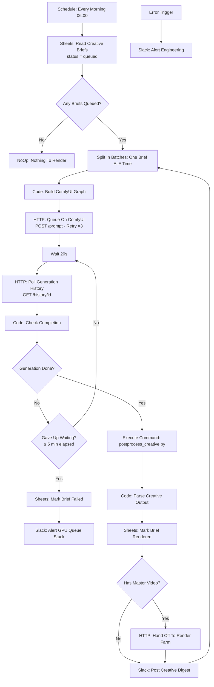

# ⚡ Generative Creative Factory (ComfyUI / SDXL): A Spreadsheet Row In, Placement-Ready Ad Creatives Out

[](https://n8n.io)
[](./workflow.json)
[](https://github.com/comfyanonymous/ComfyUI)
[](../LICENSE)

> **Quick Summary:** A scheduled n8n workflow that reads queued creative briefs from Google Sheets, **builds the ComfyUI API-format node graph in a JavaScript Code Node**, queues it on a GPU box, polls for completion with a hard give-up, then post-processes each output in Python into four ad placements with the metadata stripped. Briefs with a master video are then handed to the [Render Farm](../project-4-media-render-farm). Nobody opens the ComfyUI node editor.

---

## 📷 Workflow Preview

<!-- Add docs/images/workflow-screenshot.png after the first run with live credentials -->
*Download the ready-to-import n8n workflow file: [`workflow.json`](./workflow.json)*

---

## 🎯 Business Problem & Impact

* **The Challenge:** ComfyUI is a superb generation tool and a terrible production interface. Non-technical users reliably break the node graph. And a raw SDXL output isn't an ad: it's a 1024×1024 PNG with your whole prompt strategy embedded in its metadata.
* **The Solution:** The spreadsheet marketing already uses becomes the UI. n8n builds the graph, drives the GPU asynchronously, verifies the results, and exports finished placements.
* **Impact & ROI:**
  * **Manual steps removed:** From brief to **4 placement-ready, metadata-stripped creatives per generated image** with no human in the loop *(design target)*.
  * **Bounded failure:** The worst-case stall is capped at **about 5 minutes** (elapsed-time cap, polling every 20 s) instead of an indefinite hang that holds a worker slot.
  * **Reproducibility:** The seed is written back to the sheet, so a winning look can be regenerated at a new ratio months later.
  * **Closed loop:** Briefs paused by the [DCO Engine](../project-6-dco-engine) arrive here automatically and are regenerated the next morning.

---

## 🏗️ Workflow Architecture



---

## ⚙️ Key Technical Features

* **Programmatic graph construction:** `Build ComfyUI Graph` emits ComfyUI's API-format JSON (checkpoint loader, positive/negative CLIP encoders, empty latent, KSampler, VAE decode, save) and wires node references by hand:

  ```js
  '5': { class_type: 'KSampler',
         inputs: { seed, steps, cfg, sampler_name: 'dpmpp_2m', scheduler: 'karras',
                   denoise: 1, model: ['1', 0], positive: ['2', 0],
                   negative: ['3', 0], latent_image: ['4', 0] } },
  ```

* **Async polling loop with a hard give-up:** `/prompt` is fire-and-forget. The loop polls `/history/{prompt_id}` every 20 s and measures elapsed time since the brief started. After 5 minutes it marks the brief `failed_timeout` and alerts. It uses elapsed time rather than a counter because each poll response replaces `$json`, so a counter carried on the item would reset every loop and never time out. **A workflow that gives up loudly is worth more than one that waits politely forever.**
* **Retry on submission:** `Queue On ComfyUI` uses node-level **Retry On Fail (3 tries, 5 s apart)**.
* **Workflow-to-workflow contract:** For briefs with a `videoSourcePath`, `Hand Off To Render Farm` POSTs to the Render Farm webhook (`$env.N8N_BASE_URL/webhook/render-request`). Two workflows with a clean contract beat one workflow doing both jobs.
* **Python post-processing** ([`scripts/postprocess_creative.py`](./scripts/postprocess_creative.py)):
  * It downloads from `/view` with a size floor. A sub-1 KB response is a ComfyUI error page and raises instead of being saved.
  * It exports 1:1, 4:5, 9:16 and 1.91:1 placements via `ImageOps.fit`, biased slightly above centre.
  * It re-saves as progressive JPEG, which **drops the PNG text chunks** holding the prompt graph.
  * Errors are isolated per image and returned as JSON, never as a traceback on stdout.
* **Resilient error handling:** Timeouts take the failure branch. Unexpected crashes go to the **Error Trigger**.

---

## 🧠 Why It's Built This Way

* **A spreadsheet is the UI.** It's already open, it supports comments, and it doubles as the status ledger.
* **One brief at a time.** GPU inference is serial anyway. Concurrent briefs just fail together when VRAM runs out.
* **The script speaks JSON.** The downstream Code Node parses stdout, and `{"ok": false, "error": "..."}` makes a far better alert than a traceback.

---

## 🔐 Prerequisites & Environment Variables

n8n v1.0+ with Python 3 + Pillow in the container (the repo-root compose file builds it in ([`docker/n8n.Dockerfile`](../docker/n8n.Dockerfile))), and a reachable ComfyUI instance.

| Variable / Credential | Description | Used by |
| :--- | :--- | :--- |
| `COMFYUI_URL` | ComfyUI base URL, e.g. `http://comfyui:8188` | Queue, Poll, Check Completion |
| `CREATIVE_SHEET_ID` | Google Sheet holding `Creative Briefs` | Read / Mark Rendered / Mark Failed |
| `N8N_BASE_URL` | This n8n instance, used for the Render Farm hand-off | Hand Off To Render Farm |
| `Google Sheets - Creative Ops (demo)` | Google Sheets OAuth2 | Brief queue + status ledger |
| `Slack - Creative Ops (demo)` | Slack API (`chat:write`) | Digest, GPU-stuck alert, engineering alert |

**Note:** recent n8n releases block `$env` access and disable Execute Command by default. The repo-root compose file re-enables both (`N8N_BLOCK_ENV_ACCESS_IN_NODE=false`, `NODES_EXCLUDE=[]`). Only do that on an instance you control.

Sheet columns: `briefId, campaign, subject, style, lighting, negative, checkpoint, width, height, batchSize, seed, steps, cfg, status`, plus optional `videoSourcePath` and `hooks` (pipe-separated, e.g. `Try it free|50% off today`) for the Render Farm hand-off.

Environment variables reach the workflow as `$env.NAME` through the repo-root [`docker-compose.yml`](../docker-compose.yml) (`env_file: .env`, see [`.env.example`](../.env.example)), which also sets `N8N_BLOCK_ENV_ACCESS_IN_NODE=false`.

> **Error Trigger:** the workflow names itself as its error workflow (`settings.errorWorkflow`), so failures alert Slack out of the box. Importing through the editor can give the workflow a new ID. If so, open **Workflow Settings → Error Workflow** and select this workflow again (or a shared error-handler workflow).

---

## 🚀 Quick Start / How to Import

> **Full standalone installation guide:** [`SETUP.md`](./SETUP.md) covers every credential with its scopes, the sheet layout, a Docker setup for this workflow only, a node-by-node reference and test steps.

1. **Import** [`workflow.json`](./workflow.json), set the environment variables, and map the credentials.
2. **Add a brief row** with `status = queued`, e.g. `b_001 | summer_sale | iced coffee can on marble | editorial product photography | soft morning window light | … | 1024 | 1024 | 4 | | 28 | 6.5 | queued`.
3. **Execute** the workflow manually (or wait for 06:00).
4. The post-processor also runs standalone:

```bash
python3 scripts/postprocess_creative.py \
  --brief b_001 --campaign summer_sale --out-dir ./out \
  --images '[{"filename":"x.png","url":"http://comfyui:8188/view?filename=x.png&type=output"}]'
```

---

## 🧪 Edge Cases & Testing Strategy

| Scenario | Handled By | Outcome |
| :--- | :--- | :--- |
| GPU queue wedged (e.g. OOM) | Elapsed-time check → `Gave Up Waiting?` | After 5 minutes: brief marked `failed_timeout`, Slack alert, next brief continues |
| Brief has no master video | `Has Master Video?` | Creatives are logged and announced. No hand-off request is sent |
| ComfyUI briefly unreachable on submit | Node-level Retry On Fail | 3 attempts, 5 s apart |
| `/view` returns an error page instead of an image | Size floor in `postprocess_creative.py` | Raised and reported per image. The other images still process |
| No briefs queued | `Read Creative Briefs` (*Always Output Data*) → `Any Briefs Queued?` | NoOp, and the run ends cleanly |
| Unexpected workflow failure | **Error Trigger** → Slack | Engineering alerted |

---

## 🛣️ Roadmap / v2 Hardening (not yet built)

* **LLM prompt expansion:** An OpenAI node turns a one-line brief into structured positive/negative prompts.
* **Vector memory of winners:** Store prompts of variants the DCO Engine scaled in a vector store and retrieve them as few-shot examples.
* **Brand-safety gate:** A CLIP classifier pass that catches unintended text, watermarks and malformed hands before export.
* **WebSocket progress** instead of 20-second polling.
* **Retry sub-workflow:** Re-queue a timed-out brief once before marking it failed.

---

## 📄 License
Distributed under the [MIT License](../LICENSE).

[← Back to portfolio](../README.md)
