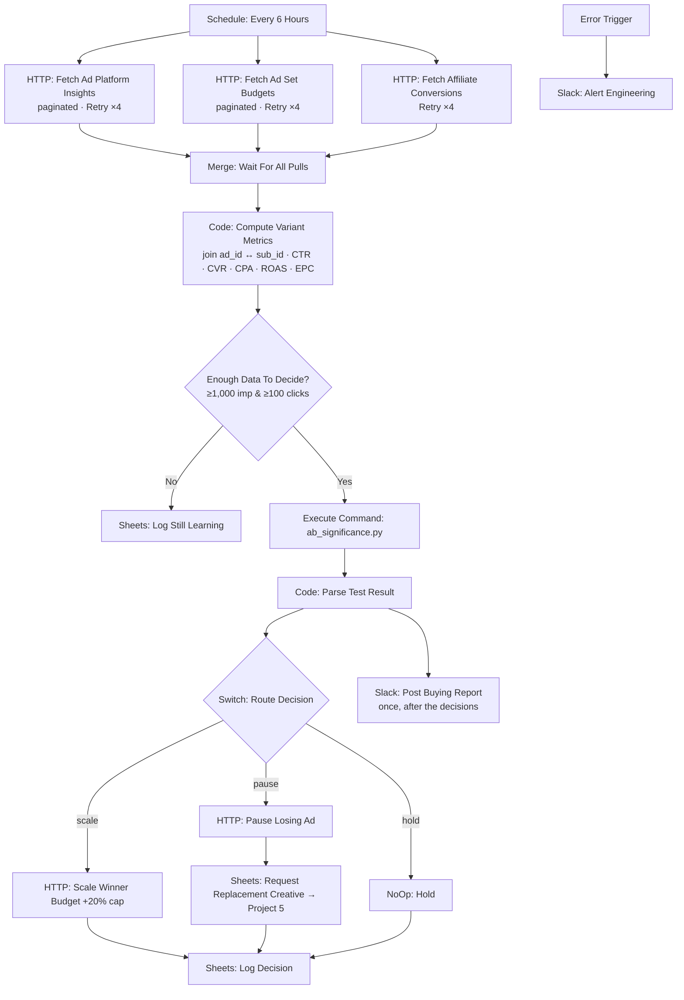

# ⚡ DCO Engine: Scale Winners, Pause Losers, and Refuse to Act on Noise

[](https://n8n.io)
[](./workflow.json)
[](./scripts/ab_significance.py)
[](../LICENSE)

> **Quick Summary:** A scheduled n8n workflow that pulls paginated ad-spend data, current ad-set budgets and affiliate revenue in parallel (all with retries), joins them on `sub_id`, and computes CTR · CVR · CPA · ROAS · EPC per creative variant in a Code Node. It runs a Bonferroni-corrected significance test in Python and only then changes budget: **scale** (+20% cap), **pause** (and auto-queue replacement creative), or **hold**.

---

## 📷 Workflow Preview

<!-- Add docs/images/workflow-screenshot.png after the first run with live credentials -->
*Download the ready-to-import n8n workflow file: [`workflow.json`](./workflow.json)*

---

## 🎯 Business Problem & Impact

* **The Challenge:** Ad platforms can't see affiliate revenue, so optimizing to their in-app metric optimizes toward clicks that don't pay. Worse, most "winning" creatives are noise. A variant at 7% CVR against a 5% control looks like a 40% lift and reverses next week. A pipeline that auto-scales into that turns random numbers into spend.
* **The Solution:** An unattended buying loop with **two refusal gates** (a volume floor and statistical significance), a hard ROAS floor, capped budget steps, and a creative loop that refills itself.
* **Impact & ROI:**
  * **Real-world origin:** At Ecomobi I ran this playbook by hand and with rule-based automation: **$4K/month ad spend, 180% average ROI, and a 60% cut in wasted spend** from automated placement blacklisting and micro-bid adjustments. This workflow is that playbook, made statistically rigorous and hands-free.
  * **Zero budget changes on insignificant lifts:** A +40% "winner" at p = 0.0194 is **held** against an adjusted α of 0.0167. You can reproduce this from [`fixtures/variants.json`](./fixtures/variants.json).
  * **Loss containment:** A variant below **70% of target ROAS is paused on economics alone**, without waiting for significance.
  * **Cadence:** Decisions every **6 hours** instead of whenever someone next checks a dashboard.

---

## 🏗️ Workflow Architecture



---

## ⚙️ Key Technical Features

* **Parallel API ingestion with pagination and retries:** Both fetches start from one trigger. The ad-platform pull uses the HTTP Request node's built-in pagination (`responseContainsNextURL`). Both use node-level **Retry On Fail ×4, 10 s apart**, because a partial pull would silently understate spend and skew every decision.
* **Cross-source join:** A `Merge` node (append mode, 3 inputs) waits for all three pulls. `Compute Variant Metrics` then flattens every API page (`{ data: [...] }`) into rows and joins spend to revenue on the sub-ID passed through the click, and attaches each ad set's current `daily_budget` (insights rows don't carry it). It does this in code because each HTTP item is a *page*, not a row. Ad names follow `campaign__variantId__placement` so spend can be rolled up per variant.
* **Metric computation in a Code Node:** It calculates CTR, CVR, CPA, ROAS and EPC, and sets `hasEnoughData` against a configurable floor (`DCO_MIN_IMPRESSIONS`).
* **Statistics in a testable script:** [`scripts/ab_significance.py`](./scripts/ab_significance.py) is stdlib-only (`math.erf`, no SciPy). It runs a two-proportion z-test with **Bonferroni correction**, because testing six variants at α = 0.05 gives about a 26% chance of at least one false winner.
* **Multi-way routing with `Switch`:** scale / pause / hold, following conservative decision bands:

  | Condition | Decision |
  |---|---|
  | ROAS < 70% of target | `pause` (regardless of significance) |
  | p ≥ adjusted α | `hold` |
  | Significant, lift ≥ +10% | `scale` |
  | Significant, lift ≤ −15% | `pause` |
  | Significant, lift in between | `hold` |

* **One test per cycle:** `Run Significance Test` is set to *Execute Once*, so all variants go to the script together instead of one run per item.
* **Never scale blind:** If a variant's current budget can't be read, `Parse Test Result` downgrades `scale` to `hold`, because `0 × 1.2` would set the ad set's budget to zero.
* **Capped mutations:** Budget steps are limited to `DCO_SCALE_STEP` (default ×1.2), because doubling a winner resets the platform's learning phase. The mutating calls use Retry On Fail ×3.
* **One report per cycle:** `Post Buying Report` hangs off `Parse Test Result`, not `Log Decision`. Log Decision runs once per decision branch, so a report attached there would post up to three times. The e2e test caught exactly that.
* **Self-refilling creative loop:** A paused variant appends a brief (`requestedBy: dco_engine`, plus the reason) to the sheet the [Generative Creative Factory](../project-5-generative-creative-factory) reads at 06:00.
* **Credentials from the environment:** API tokens are read via `$env`, never stored in node parameters that appear in execution logs.

---

## 🧠 Why It's Built This Way

* **The interesting part is where it refuses to act.** The volume floor is the single highest-value line in the workflow. Noise is not a signal.
* **Economics override statistics.** A variant burning money doesn't need a p-value to be paused.
* **Asymmetric risk.** Scaling too slowly costs a few hours of upside. Scaling a false winner costs real money.
* **The riskiest logic is the easiest to check.** It's a file you can run from a terminal against a fixture, not code hidden inside a node.

---

## 🔐 Prerequisites & Environment Variables

n8n v1.0+ with Python 3 in the container (the repo-root compose file builds it in ([`docker/n8n.Dockerfile`](../docker/n8n.Dockerfile))).

| Variable / Credential | Description | Used by |
| :--- | :--- | :--- |
| `ADS_API_URL`, `ADS_API_TOKEN` | Ad platform base URL + Bearer token | Fetch Insights, Scale, Pause |
| `AFFILIATE_API_URL`, `AFFILIATE_API_KEY` | Affiliate network URL + `X-Api-Key` | Fetch Affiliate Conversions |
| `CREATIVE_SHEET_ID` | Sheet shared with Project 5 | Request Replacement Creative |
| `DCO_MIN_IMPRESSIONS` | Volume floor (default `1000`) | Compute Variant Metrics |
| `DCO_TARGET_ROAS` | Target ROAS (e.g. `1.3`) | Compute Variant Metrics |
| `DCO_SCALE_STEP` | Budget multiplier per cycle (e.g. `1.2`) | Scale Winner Budget |
| `Google Sheets - Creative Ops (demo)` | Google Sheets OAuth2 | Decision log, learning log, briefs |
| `Slack - Growth (demo)` | Slack API (`chat:write`) | Buying report, engineering alert |

**Note:** recent n8n releases block `$env` access and disable Execute Command by default. The repo-root compose file re-enables both (`N8N_BLOCK_ENV_ACCESS_IN_NODE=false`, `NODES_EXCLUDE=[]`). Only do that on an instance you control.

Environment variables reach the workflow as `$env.NAME` through the repo-root [`docker-compose.yml`](../docker-compose.yml) (`env_file: .env`, see [`.env.example`](../.env.example)), which also sets `N8N_BLOCK_ENV_ACCESS_IN_NODE=false`.

> **Error Trigger:** the workflow names itself as its error workflow (`settings.errorWorkflow`), so failures alert Slack out of the box. Importing through the editor can give the workflow a new ID. If so, open **Workflow Settings → Error Workflow** and select this workflow again (or a shared error-handler workflow).

---

## 🚀 Quick Start / How to Import

> **Full standalone installation guide:** [`SETUP.md`](./SETUP.md) covers every credential with its scopes, the sheet layout, a Docker setup for this workflow only, a node-by-node reference and test steps.

1. **Import** [`workflow.json`](./workflow.json), set the environment variables, and map the credentials.
2. **Dry-run the decision logic first**, with no APIs needed:

```bash
python3 scripts/ab_significance.py --metric cvr --alpha 0.05 --variants "$(cat fixtures/variants.json)"
```

Expected: `hero_story_b` (+40% lift, p = 0.0194 against an adjusted α of 0.0167) is **held**, and `hero_story_c` (ROAS 0.57, below the 0.91 floor) is **paused**.

3. **Activate** once the sandbox ad account is connected.

---

## 🧪 Edge Cases & Testing Strategy

| Scenario | Handled By | Outcome |
| :--- | :--- | :--- |
| API rate limit / transient 5xx | Node-level Retry On Fail | 4 attempts, 10 s apart, on both ingestion calls |
| Variant with too little data | `Enough Data To Decide?` | Logged as `insufficient_data`, no action |
| Scale decision but current budget unknown | Guard in `Parse Test Result` | Downgraded to `hold` with the reason logged |
| Large lift that isn't significant after correction | `ab_significance.py` → `hold` | No budget change this cycle |
| Variant burning money | ROAS floor in decision bands | Paused and replacement brief queued |
| Unexpected failure | **Error Trigger** → Slack | Engineering alerted with the failed execution |

---

## 🛣️ Roadmap / v2 Hardening (not yet built)

* **OAuth2 platform credentials** (Meta / Google Ads) instead of static tokens.
* **`Retry-After`-aware pagination:** A `Split In Batches` + `Wait` loop that honours the server's back-off header. The pattern is already implemented and tested in Python in [Project 8](../project-8-integration-kit).
* **Bayesian decisions:** Beta-Binomial posteriors suit a 6-hour sequential cycle better than repeated frequentist tests.
* **Bandit allocation** and **creative-fatigue detection** from CTR-decay curves.
* **Holdout groups**, so the engine's contribution is measured rather than assumed.

---

## 📄 License
Distributed under the [MIT License](../LICENSE).

[← Back to portfolio](../README.md)
