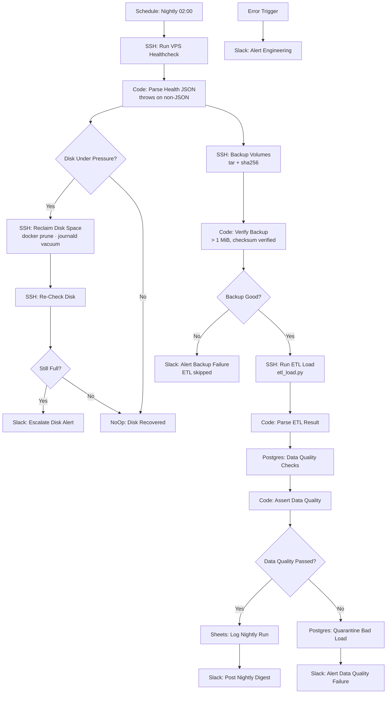

# ⚡ VPS Ops & Nightly Data Pipeline: Self-Healing Infrastructure and an ETL That Won't Commit a Bad Load

[](https://n8n.io)
[](./workflow.json)
[](./scripts/etl_load.py)
[](../LICENSE)

> **Quick Summary:** A nightly n8n workflow that SSHes into an Ubuntu VPS and runs a Bash healthcheck that returns JSON. It self-heals disk pressure and verifies the fix, takes a checksum-verified backup of the Docker volumes, and only then runs an idempotent Python ETL into PostgreSQL. SQL data-quality assertions follow, and a bad load is **quarantined** instead of reaching the dashboards.

---

## 📷 Workflow Preview

<!-- Add docs/images/workflow-screenshot.png after the first run with live credentials -->
*Download the ready-to-import n8n workflow file: [`workflow.json`](./workflow.json)*

---

## 🎯 Business Problem & Impact

* **The Challenge:** Self-hosted stacks fail quietly. The disk fills up until Postgres refuses writes at 3am. A backup "succeeds" and turns out to be 200 bytes. An ETL exits 0 having loaded nothing, and every downstream dashboard shows a confident, wrong flat line.
* **The Solution:** A pipeline built on one rule: **exit code 0 is not evidence that a job did its work.** Every stage verifies its own output before the next stage runs.
* **Impact & ROI:**
  * **Backups:** **0 unverified backups are counted as success**. Each archive must exceed 1 MiB and pass a checksum read-back *(enforced by `Verify Backup`)*.
  * **Data integrity:** **0 failed-DQ loads committed to reporting tables**. They are quarantined with a reason attached *(enforced by `Data Quality Passed?`)*.
  * **Unattended remediation:** Disk pressure is cleared automatically, and someone is paged **only if usage is still above 85% after cleanup** *(design target)*.
  * **Safe re-runs:** Deterministic event IDs + `ON CONFLICT` upserts mean a failed night can be re-run **without double-counting**.

---

## 🏗️ Workflow Architecture



---

## ⚙️ Key Technical Features

* **JSON-over-SSH script contract:** [`vps_healthcheck.sh`](./scripts/vps_healthcheck.sh) emits exactly one JSON object: disk %, available MB, memory % (from `MemAvailable`, not `free`), load, containers, unhealthy containers, failed systemd units, and TLS days-to-expiry. `Parse Health JSON` throws loudly if stdout isn't JSON.
* **Self-heal, then verify:** `docker system prune -af --filter 'until=168h'` + `journalctl --vacuum-time=7d`, then a **re-check** before deciding whether to page anyone.
* **Verified backups:** [`backup_volumes.sh`](./scripts/backup_volumes.sh) reads each named volume through a throwaway `alpine` container, tars it, checksums it, and reads the archive back (`tar -tzf`). It writes to `.partial` and then `mv`s, and retention runs **last, only after verification**.
* **Gated ETL:** The ETL runs only if the backup passed. Loading data on a night with no backup is the wrong risk to take.
* **Idempotent upserts:** [`etl_load.py`](./scripts/etl_load.py) builds `sha256(source|ip|timestamp|method|path)[:32]` keys, de-duplicates within the batch, and upserts via `ON CONFLICT (event_id) DO UPDATE` in a single transaction.
* **SQL data-quality gate** via the Postgres node:

  | Assertion | Catches |
  |---|---|
  | `rows_today = 0` | Source path changed, permissions broke, silent no-op |
  | `null_keys > 0` | Parser regressed against a changed log format |
  | `duplicate_keys > 0` | Idempotency key collision |
  | `rows < 40% of trailing 7-day average` | A partial upstream break that looks like a quiet day |

* **Quarantine, not delete:** Failing rows move to `events_quarantine` with the reason, and `#ops` is told the dashboards are showing yesterday's data. **Stale-but-correct beats fresh-but-wrong.**
* **Credentials & security:** Postgres credentials come from `PGHOST`/`PGUSER`/`PGPASSWORD` on the VPS, never from the command line, because the full command of every SSH call is recorded in the n8n execution log.

---

## 🧠 Why It's Built This Way

* **SSH rather than an agent.** There's no extra daemon on the box that could itself fail silently.
* **Scripts report, the workflow decides.** The node graph stays readable, and every script can be run by hand during a 2am incident.
* **Healthcheck exit code 0 whenever it *ran*.** "The server is unhealthy" is data to act on, not a script error. Every `docker` pipeline ends in `|| true` under `pipefail`, so one probe failure can't blind the whole check.

---

## 🔐 Prerequisites & Environment Variables

n8n v1.0+, an Ubuntu VPS reachable over SSH with the scripts in `/opt/ops`, and PostgreSQL.

| Credential / Variable | Type | Used by |
| :--- | :--- | :--- |
| `Ubuntu VPS - ops user (demo)` | SSH (swap to key-based auth in production) | Healthcheck, Reclaim, Re-Check, Backup, ETL |
| `Analytics Postgres (demo)` | Postgres | Data Quality Checks, Quarantine Bad Load |
| `Google Sheets - Ops (demo)` | Google Sheets OAuth2 | Log Nightly Run |
| `Slack - Ops (demo)` | Slack API (`chat:write`) | Digest, disk/backup/DQ alerts, engineering alert |
| `PGHOST`, `PGUSER`, `PGPASSWORD` | Environment on the **VPS** | `etl_load.py` |

Environment variables reach the workflow as `$env.NAME` through the repo-root [`docker-compose.yml`](../docker-compose.yml) (`env_file: .env`, see [`.env.example`](../.env.example)), which also sets `N8N_BLOCK_ENV_ACCESS_IN_NODE=false`.

> **Error Trigger:** the workflow names itself as its error workflow (`settings.errorWorkflow`), so failures alert Slack out of the box. Importing through the editor can give the workflow a new ID. If so, open **Workflow Settings → Error Workflow** and select this workflow again (or a shared error-handler workflow).

---

## 🚀 Quick Start / How to Import

> **Full standalone installation guide:** [`SETUP.md`](./SETUP.md) covers every credential with its scopes, the sheet layout, a Docker setup for this workflow only, a node-by-node reference and test steps.

1. **Deploy the scripts:**

```bash
scp scripts/*.sh scripts/*.py ops@your-vps:/opt/ops/
ssh ops@your-vps 'chmod +x /opt/ops/*.sh'
```

2. **Run each one by hand first.** They're all designed to run standalone:

```bash
bash /opt/ops/vps_healthcheck.sh --domain example.com | jq .
bash /opt/ops/backup_volumes.sh --retain 7 | jq .
python3 /opt/ops/etl_load.py --since-hours 24 --dry-run | jq .
```

3. **Import** [`workflow.json`](./workflow.json), map the SSH, Postgres, Sheets and Slack credentials, and **Activate**.

---

## 🧪 Edge Cases & Testing Strategy

| Scenario | Handled By | Outcome |
| :--- | :--- | :--- |
| Healthcheck prints a traceback instead of JSON | `Parse Health JSON` throws | **Error Trigger** → engineering alert |
| Disk above threshold | Reclaim → Re-Check → `Still Full?` | Self-healed silently, or escalated if still full |
| Backup "succeeds" but is tiny or corrupt | `Verify Backup` (> 1 MiB + checksum) | Backup alert. **ETL skipped** for the night |
| Overlapping rotated logs produce duplicate lines | In-batch de-dup + `ON CONFLICT` | No double counting. Re-run is safe |
| ETL loads 0 rows or a partial day | SQL DQ assertions | Load quarantined, `#ops` alerted |
| Docker daemon unreachable during healthcheck | `|| true` + `docker_reachable: false` | Reported as data. The healthcheck still completes |

---

## 🛣️ Roadmap / v2 Hardening (not yet built)

* **Monthly restore test:** Restore the latest archive into a scratch container and assert row counts. An untested restore path is a hope, not a backup.
* **Dead-letter replay:** A sub-workflow that re-processes `events_quarantine` rows once the upstream is fixed.
* **Metrics:** Emit to the [Project 9](../project-9-observability-layer) Prometheus exporter instead of Sheets.
* **Off-site replication** of verified archives, plus dbt / great_expectations tests once the assertion count grows.

---

## 📄 License
Distributed under the [MIT License](../LICENSE).

[← Back to portfolio](../README.md)
