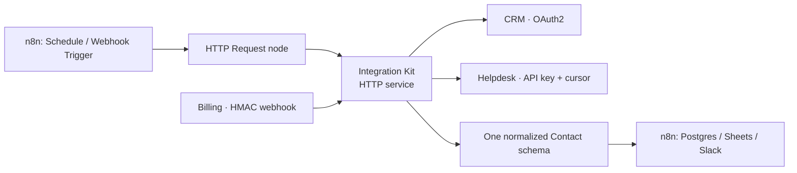

# ⚡ Integration Kit: OAuth2, Signed Webhooks and Paginated Pulls, Built So They Survive Production

[](.)
[](./tests)
[](#-how-it-plugs-into-n8n)
[](../LICENSE)

> **Quick Summary:** A production-grade Python integration service that pulls from three third-party APIs, each with a different auth model: **OAuth2 with single-flight token refresh**, **HMAC-SHA256 signed webhooks** with a replay window and claim-once idempotency, and **API key with cursor pagination** plus loop guards. It normalizes all three into one Contact schema. It's what an n8n node does for you, with the node removed so every edge case can be seen and tested.

---

## 🔌 How It Plugs Into n8n

n8n's built-in nodes handle OAuth refresh, webhook verification and pagination for the vendors they support. When a vendor has no node, or its node gets these edge cases wrong, this is the service an n8n workflow calls through an **HTTP Request** node. Run it as a small HTTP service next to n8n (a container or a serverless function), and point the HTTP Request node at it.



---

## 🎯 Business Problem & Impact

* **The Challenge:** Integrations don't break on the happy path. They break when eight workers refresh a token at once and the provider revokes the grant, when a webhook is replayed six months later, or when an API returns the same cursor forever.
* **The Solution:** Every one of those failure modes is handled explicitly and **proved by a test**. See the table below.
* **Impact & ROI:**
  * **Revoked-grant outages from refresh races:** OAuth refresh is proven single-flight with **8 concurrent threads → exactly 1 token call**.
  * **Duplicate charges from redelivered webhooks:** Claim-once idempotency is proven with **20 threads → exactly 1 winner**.
  * **Runaway API loops:** Repeated cursors and empty-page-with-cursor responses raise errors, with a hard `max_pages` cap.
  * **Reliability:** **83 tests**, standard library only, and the full demo runs offline with no credentials.

---

## 🚀 Quick Start

```bash
cd project-8-integration-kit
py -m unittest discover -s tests -t . -v     # 83 tests
py -m integration_kit.sync --demo            # expired token → refresh → rate-limited paginated pull → signed webhook → duplicate → merge
```

---

## 📚 Deep Dive

**Three third-party APIs. Three genuinely different auth models. One internal schema.**

Production Python, standard library only, 83 tests, no network required to run any of it.

---

## Why this project exists

If you have built automation in n8n, you have already used OAuth refresh, webhook verification and paginated pulls — you just used them through a node that did it for you. This project is the same work with the node removed, so what n8n was handling is visible and inspectable.

It is deliberately built around the three things that break in production, rather than the happy path a tutorial shows you:

| What breaks | How this handles it | Proved by |
|---|---|---|
| Eight workers refresh an OAuth token at the same instant and the provider revokes the grant | Single-flight refresh behind a lock, with a double-check inside it | `test_concurrent_refresh_is_single_flight` — 8 real threads, asserts exactly 1 token call |
| A rotating provider issues a new refresh token and you keep the old one | New refresh token stored; falls back to the old one when the provider omits it | `test_rotating_refresh_token_is_stored`, `test_non_rotating_provider_keeps_old_refresh_token` |
| Token expires *in flight*, so a 401 arrives on a request you already sent | Connector catches `AuthError` once, invalidates, replays — exactly once | `CrmConnector.fetch_contacts` |
| A CDN sends `Retry-After` as an HTTP-date, your client only parses integers | Both forms parsed; server instruction beats our own backoff | `test_http_date`, `test_429_honours_retry_after_over_backoff` |
| A server says `Retry-After: 3600` and parks your worker for an hour | `max_retry_after` cap | `test_retry_after_is_capped` |
| Everyone retries at the same moment when a dependency recovers | Full jitter — `sleep = random(0, cap)` | `test_full_jitter_stays_within_the_cap` |
| A timed-out POST already succeeded, and the retry duplicates it | POST is not retried unless the caller asserts an idempotency key | `test_post_is_not_retried_by_default` |
| Your webhook URL leaks and anyone can post to it | HMAC-SHA256 over `timestamp.payload`, constant-time compare | `test_wrong_secret_rejected`, `test_tampered_payload_rejected` |
| A captured request from six months ago is replayed — and verifies | ±300s replay window, enforced on the *signed* timestamp | `test_old_but_validly_signed_request_rejected` |
| An attacker edits the timestamp to dodge that window | Timestamp is inside the signed string, so editing it breaks the signature | `test_tampered_timestamp_rejected` |
| Rotating the webhook secret breaks every in-flight delivery | Multiple secrets accepted; multiple `v1=` values parsed | `test_secret_rotation_accepts_both` |
| The provider delivers the same event twice and you charge twice | Atomic claim-once idempotency store with TTL | `test_claim_is_atomic_under_threads` — 20 threads, exactly 1 winner |
| The API returns the cursor you just sent, forever | Cursor loop detection | `test_repeated_cursor_raises_instead_of_looping` |
| The API always returns a cursor, even on the last page | Empty-page-with-cursor is an error, plus a hard `max_pages` | `test_empty_page_with_a_next_cursor_raises` |
| A 400k-row pull loads into memory | Generators all the way down | `test_it_is_lazy` |
| Two sources disagree about someone's name and the record flickers | Explicit source-trust ranking, recency only as a tiebreak | `test_more_trusted_source_wins_a_conflict` |

---

## Run it

No dependencies. No credentials. No accounts.

```bash
cd project-8-integration-kit
py -m unittest discover -s tests -t . -v
```

```bash
py -m integration_kit.sync --demo
```

The demo runs the whole pipeline against in-repo fakes — expired token → refresh → rate-limited paginated pull with real backoff → signed webhook → duplicate webhook → normalise → merge:

```
=== Integration Kit demo ===
OAuth refreshes performed : 1 (token was expired at start)
Token endpoint calls      : 1
Backoff sleeps honoured   : [2.0]
Webhook first delivery    : grace@example.com
Webhook duplicate replay  : None (deduplicated)
Contacts after merge      : 3
```

Four source records in, three contacts out. Ada arrives from both the CRM and the helpdesk and merges into one; Grace arrives from both the CRM and a billing webhook and merges into one; the helpdesk record with an unusable email address stays separate, because merging on a bad key is worse than not merging.

---

## The three auth models, and why each is hard for a different reason

### 1. OAuth2 refresh — `integration_kit/oauth.py`

The hard part is not building the `Authorization` header. It is concurrency.

The naive version is correct under one thread and wrong under eight:

```python
if token.expired():
    token = refresh()      # eight workers all reach here together
return token.access_token
```

On a **rotating** provider (Google, Okta, Auth0), refresh #1 returns a new refresh token and invalidates the old one. Refreshes #2–#8 are still presenting the old one. Several providers treat a reused refresh token as a breach signal and revoke the entire grant — your integration is now dead until a human re-consents. On a non-rotating provider you merely burn your token-endpoint rate limit on the one call you cannot afford to lose.

The fix is single-flight:

```python
with self._lock:
    token = self.store.load()          # re-read inside the lock
    if token is not None and not token.expired(...):
        return token.access_token      # someone else already refreshed
    refreshed = self._refresh(token)
```

The second check inside the lock is the entire mechanism. Without it, the threads queued on the lock each refresh in turn and you have serialised the bug rather than fixed it.

There is also a 60-second **expiry skew**. A token checked as valid can expire in transit; the margin buys you the request's flight time plus clock drift. Without it you get periodic 401s you cannot reproduce.

**Honest limitation:** the lock is a `threading.Lock`, so it covers one process. With more than one replica you need the same logic against a shared store — a Postgres row lock, or Redis `SET NX`. The shape of the code does not change; the lock does. This is called out in the module docstring rather than left for a reviewer to find.

### 2. HMAC-signed webhooks — `integration_kit/webhooks.py`

Inverted from the other two: no credential goes out, a shared secret proves what came in. The failure mode is silent, which is what makes it dangerous — an unverified endpoint works perfectly until someone posts to it.

Three independent defences, and skipping any one leaves a real hole:

**Signature** proves it came from someone holding the secret. Webhook URLs leak constantly — browser history, Slack, a screenshot in a support ticket.

**Replay window** proves it is recent. A signature is valid forever; a captured request replayed six months later verifies perfectly. The timestamp is only trustworthy because it is signed *with* the payload (`t.payload`), which is why the signature is checked before the window.

**Idempotency** proves you have not already processed it. Stripe, GitHub and Shopify all deliver at-least-once. They retry on any non-2xx — including the 2xx you failed to return because your process died *after* doing the work. If a duplicate delivery charges a customer twice, that is your bug.

Two details that are easy to get wrong:

```python
if hmac.compare_digest(expected, candidate):   # not ==
```

`==` short-circuits on the first differing byte. That timing difference is enough to recover a valid signature byte by byte over enough requests.

```python
for part in header.split(","):
    if key == "v1":
        signatures.append(value)   # plural, not [0]
```

Multiple `v1=` values are how secret rotation works: during a rollover the sender signs with both secrets. A receiver that reads only the first breaks every rotation.

`IdempotencyStore.claim()` is a single atomic check-and-set, not `seen()` then `add()`. The 20-thread test exists specifically to catch the two-call version.

### 3. API key + cursor pagination — `integration_kit/connectors/helpdesk.py`

The simplest auth, so the difficulty moves to volume. A static key never expires; instead you are walking tens of thousands of records through an endpoint that rate-limits.

Cursor pagination over offset pagination because offsets are wrong on a changing dataset — insert a row mid-walk and every later page shifts, so you skip a record or read one twice. But cursors introduce two ways to hang a worker forever, both of which are real API behaviours:

- the server returns the cursor you just sent;
- the server always returns a cursor, even on the last page.

Both symptoms are identical: a job that never finishes and a worker that looks busy. So the walker carries a repeated-cursor check, an empty-page check, and a hard `max_pages`, and raises on all three rather than spinning.

The key goes in a header, never a query string — query strings land in access logs, proxy logs, and `Referer` headers.

---

## Normalisation — `integration_kit/schema.py`

Without this layer, every downstream consumer has to know which system a record came from, and "which system" leaks into every report and every `if` statement in the business logic.

Decisions worth defending in an interview:

**`raw` is kept.** Normalisation is lossy, and someone will eventually ask "where did this value come from?" while holding a screenshot. Keeping the source payload turns that from archaeology into a lookup.

**Email normalisation is deliberately dumb.** Lowercase and trim, nothing else. Stripping dots and `+tags` is Gmail-specific; applied universally it merges two genuinely different people. A duplicate is annoying. A false merge is a data-loss incident someone has to unpick by hand.

**Merge precedence is explicit, not last-write-wins.**

```python
SOURCE_TRUST = {"helpdesk": 10, "billing": 20, "crm": 30}
```

The CRM is authoritative for identity because that is where a human curates it. Recency only breaks a tie *within* the same trust level. And a present value is never overwritten by an absent one — a less-trusted source that happens to know the phone number still contributes it.

**Timestamps.** Unix seconds, unix milliseconds and ISO-8601 all arrive from these three APIs. All three are converted to UTC ISO with an explicit offset at the boundary and nowhere else. A naive datetime in a shared schema is a bug waiting for a daylight-saving transition.

**IDs are deterministic**, keyed on email where there is one:

```python
basis = email if email else source + ":" + source_id
return "ct_" + hashlib.sha256(basis.encode()).hexdigest()[:20]
```

Same email from two systems gives the same ID, which is what makes the merge possible at all. No email falls back to a source-scoped ID, so helpdesk `9002` and CRM `9002` cannot collide.

---

## How it is structured, and why

```
integration_kit/
├── errors.py         RetryableError vs PermanentError — the boundary that matters
├── http.py           Transport seam + retry policy
├── oauth.py          single-flight token refresh
├── webhooks.py       HMAC verify, replay window, idempotency store
├── pagination.py     cursor walker with loop guards
├── schema.py         Contact + normalisers + merge
├── sync.py           ties it together; `--demo` runs it all offline
└── connectors/
    ├── crm.py        OAuth2
    ├── billing.py    HMAC webhook
    └── helpdesk.py   API key + cursor
```

**`Transport` is the only thing that knows what a socket is.** Everything else takes a `Transport`. That single seam is what lets 83 tests drive the *real* retry loop, the *real* pagination walker and the *real* token manager, instead of patching `urllib` and asserting that we called `urllib` — which tests nothing you care about.

The same applies to time. `sleeper` and `clock` are injected, so the backoff tests assert the exact schedule `[1.0, 2.0, 4.0]` in 63 milliseconds instead of waiting seven seconds for it.

**Connectors share no state and do not import each other.** Adding a fourth source means adding a file, not editing three.

**The retryable/permanent split is the most important line in the codebase.** Get it wrong in one direction and you hammer an endpoint returning 401 because a credential was revoked. Get it wrong in the other and one blip takes the whole integration down.

---

## What I would do differently at real scale

Written down because a reviewer will ask, and "I hadn't thought about it" is a worse answer than a scoped limitation:

- **Cross-process refresh lock.** As above — `threading.Lock` covers one process. Two replicas need Postgres or Redis.
- **Idempotency store is in-memory.** Same problem. Redis `SET NX EX` or a unique index on `(event_id)`.
- **Webhook handling should return 200 first, work second.** Right now `handle()` verifies and processes inline. At volume you verify, claim, enqueue, return 200 in single-digit milliseconds, and process off the queue — because providers time out fast and a slow 200 looks like a failed delivery.
- **No circuit breaker.** Retries are per-request. A source that has been failing for ten minutes should be skipped wholesale rather than retried four times per record.
- **Phone normalisation is not libphonenumber.** It is deterministic and testable, and it documents the assumption (`default_country="+61"`) instead of hiding it. For real international data, use the library.
- **Merge is pairwise and order-independent by construction**, but it has no audit trail. In production you would want to record which source won each field.

---

## Test suite

```
83 tests, 0.06s, stdlib unittest only
```

| File | Covers |
|---|---|
| `test_oauth.py` | refresh triggering, expiry skew, rotation, single-flight under 8 threads |
| `test_webhooks.py` | signature, tampering, rotation, replay window edges, idempotency under 20 threads |
| `test_retry.py` | `Retry-After` both formats, backoff schedule, jitter bounds, what is and is not retried |
| `test_pagination.py` | full walk, query-string building, loop guards, laziness, 429 mid-walk |
| `test_schema.py` | normalisers, deterministic IDs, all three mappings, merge precedence |

Every test is written so that it **fails if the behaviour it names is removed**. Delete the lock in `TokenManager.access_token` and `test_concurrent_refresh_is_single_flight` reports `8 != 1`. That is the bar — a test that passes against a broken implementation is worse than no test, because it tells you the code is fine.

One of these caught a real bug during development: `test_helpdesk_record_maps` failed because the connector returned `""` rather than `None` for a missing company name. An empty string downstream renders as a blank cell that looks like real data. The connector was fixed, not the assertion.

---

## Where to start reading

1. `integration_kit/oauth.py` — the docstring at the top explains the race in full.
2. `tests/test_oauth.py::test_concurrent_refresh_is_single_flight` — the proof.
3. `integration_kit/http.py` — the retry policy, and the `SAFE_METHODS` comment on why POST is excluded.
4. `integration_kit/webhooks.py` — the three-defences docstring.

---

[← Back to portfolio](../README.md)
