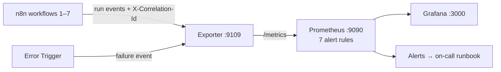

# ⚡ Observability Layer for n8n: Catch the Workflow That Silently Stopped Running

[](.)
[](./tests)
[](./prometheus)
[](./grafana)
[](../LICENSE)

> **Quick Summary:** Structured logging with **correlation IDs that survive webhook hops between workflows**, a Prometheus `/metrics` exporter, **7 alert rules**, a provisioned Grafana dashboard, and an on-call runbook for the n8n workflows in this portfolio. It includes the one alert rate-based monitoring can't produce: **"this workflow has stopped succeeding."**

---

## 🔌 How It Plugs Into n8n

Each workflow gets **three small additions**: adopt or start a correlation ID at the trigger, propagate `X-Correlation-Id` on every outbound HTTP Request, and report the outcome to the exporter on exit. The existing **Error Trigger** also reports failures. See the wiring guide in [`n8n/README.md`](./n8n/README.md).



---

## 🎯 Business Problem & Impact

* **The Challenge:** "I have error handling" is a claim nobody can check from outside. Worse, a scheduled workflow that **stops running** produces zero failures, so every error-rate dashboard stays green while nothing happens.
* **The Solution:** Alert on the **age of the last success**, and separately on "succeeding but processing 0 items". Trace one business object across multiple workflow executions with a single ID.
* **Impact & ROI:**
  * **Silent-stop detection:** `time() - n8n_workflow_last_success_timestamp_seconds > 5400` fires even when a workflow has *never* succeeded, because series are seeded at startup.
  * **Tracing:** "What happened to brief 4412?" becomes one query instead of four browser tabs.
  * **105 tests**, with the exporter verified live over a real socket.
  * **Honest status:** the three-container Docker stack (Prometheus + Grafana) **has not been started yet**. See the status table below.

---

## 🚀 Quick Start

```bash
cd project-9-observability-layer
py -m unittest discover -s tests -t . -v    # 105 tests
py -m obs.server --port 9109 &              # exporter, no Docker needed
curl -s localhost:9109/demo && curl -s localhost:9109/metrics | grep last_success
```

---

## 📚 Deep Dive

Structured logging with correlation ids that survive workflow boundaries, a Prometheus metrics endpoint, seven alert rules, a Grafana dashboard, and a written runbook with an escalation path.

105 tests, standard library only. The exporter is verified live; the Docker stack is not — see the status table below.

---

## Why this project exists

The other projects in this portfolio *claim* error handling and observability. This one makes the claim inspectable.

That matters more than adding an eighth workflow. "I have error handling" is an assertion a reviewer cannot check. A metrics endpoint they can curl, alert rules they can read, and a runbook with an escalation path are evidence.

It also closes the gap the plan identified as "no evidence of monitoring at scale" — and it is the cheapest project on that list, because the underlying work already exists. Nothing here rewrites a workflow. It adds three nodes to each one.

---

## Honest status — what has actually been run

| | Status |
|---|---|
| **105 tests** | ✅ Run, passing |
| **Exporter over a real socket** | ✅ Run — `/healthz`, `/demo`, `/events`, `/metrics` on port 9109 |
| **Exposition format** | ✅ Verified against live output: cumulative buckets, `+Inf` == `_count`, `_sum`, `_count`, `text/plain; version=0.0.4`, full-precision timestamps |
| **Correlation ID across the HTTP boundary** | ✅ Verified — an inbound `X-Correlation-Id` appears on this hop's log line |
| **`docker compose up`** | ❌ **Not run.** Docker's daemon was not running in the environment this was written in, so Prometheus loading `alerts.yml` and Grafana provisioning the dashboard are unverified |
| **Grafana screenshot with real data** | ❌ Not produced — that needs the stack up and the workflows wired in |

The Python is verified. **The three-container stack has not been started**, so treat `docker-compose.yml`, `prometheus.yml` and the Grafana provisioning as reviewed-but-unexecuted. If you are running it, `promtool check rules prometheus/alerts.yml` is the thing to try first.

This table is here because the alternative is implying a level of verification that did not happen, and that is the claim that collapses in an interview.

---

## Run it

```bash
cd project-9-observability-layer
py -m unittest discover -s tests -t . -v
```

Verified live, not just in tests:

```bash
py -m obs.server --port 9109 &
curl -s localhost:9109/demo
curl -s localhost:9109/metrics | grep 'last_success'
```

The whole stack (unverified — see the table above):

```bash
docker compose up -d
curl -s localhost:9109/demo          # synthetic traffic so the dashboards have shape
curl -s localhost:9109/metrics | head -40
```

- Exporter — http://localhost:9109/metrics
- Prometheus — http://localhost:9090 (Alerts tab shows all seven rules loaded)
- Grafana — http://localhost:3000 (`admin` / `admin`, dashboard is provisioned)

Just the exporter, no Docker:

```bash
py -m obs.server --port 9109
```

---

## The five things worth looking at

### 1. The alert that rate-based monitoring cannot produce

This is the most important design decision in the project.

A scheduled workflow that **stops running entirely** produces zero runs. Zero runs means zero failures. So the error-rate panel stays green, the error-rate alert never fires, and every dashboard says everything is fine while nothing is happening. This is the single most common blind spot in a monitoring setup, and it is structural — no amount of tuning a rate-based alert can see it.

The only thing that can is the *age of the last success*:

```promql
time() - n8n_workflow_last_success_timestamp_seconds{workflow!=""} > 5400
```

Which requires a design decision in the collector: a failure must **not** move `last_success`, or the alert can never fire. `test_failure_does_not_move_last_success` enforces that.

And a second, subtler one — `Collector.seed()`:

```python
def seed(self, workflows):
    """Create a zero series for every known workflow at startup."""
```

Without it, a workflow that has *never* succeeded has no `last_success` series at all, so `time() - last_success` returns nothing rather than a large number, and the alert that should catch "it never started" silently does not fire. That is a blind spot inside the fix for a blind spot, and it is why `test_seed_creates_series_for_workflows_that_never_ran` exists.

### 2. Succeeding and doing work are different claims

The repository's first rule is *exit code 0 is not evidence that a job did its work*. This makes it a metric:

```promql
sum by (workflow) (rate(n8n_workflow_runs_total{status="success"}[1h])) > 0
  and
sum by (workflow) (rate(n8n_workflow_items_processed_total[1h])) == 0
```

An inbox filter that stopped matching, a sheet that was renamed, an API returning an empty page — all produce a workflow that succeeds forever while delivering nothing. Same class of bug as Project 7's backup that completes and contains no files.

### 3. Correlation ids that survive a boundary

Projects 4, 5 and 6 call each other's webhooks. A creative brief enters the Generative Creative Factory, an asset is rendered by the Media Render Farm, and the DCO Engine pauses it hours later. That is four executions across three workflows.

"What happened to brief 4412" with per-workflow execution ids means opening four tabs and matching timestamps by eye.

```python
with correlation.context(from_headers(request.headers)) as cid:
    logger.info("recorded execution", extra={"workflow": event.workflow})
```

Three properties make this work rather than decorate:

**It uses `contextvars`, not an argument.** The id set at the entry point is visible to code five frames down that has never heard of it. An observability layer you have to remember to thread through has holes exactly where the incident is.

**The token is reset in a `finally`.** An exception must not leave a stale id bound for whatever the thread does next — that is one request's id on another request's logs, and there is no worse failure mode in an observability layer than lying. `test_an_exception_does_not_leave_a_stale_id_bound` covers it.

**Incoming ids are validated, not trusted.** An id from an inbound webhook is attacker-controlled and is about to be written into log files:

```python
VALID = re.compile(r"\A[a-z0-9]{1,12}-[0-9a-f]{16}\Z")
```

`\A`/`\Z`, not `^`/`$` — in Python `$` also matches before a trailing newline, so `^...$` would accept `cid-0000000000000000\ninjected log line`. That exact payload is in the test suite.

It crosses three kinds of boundary: HTTP (`X-Correlation-Id`), the Bash hop over SSH (`CORRELATION_ID` env var, for projects 4 and 7), and the log line itself.

### 4. Alerts and the dashboard are generated, so they can be tested

A dashboard exported from the Grafana UI is 900 lines of machine-written JSON, unreviewable in a diff, silently referencing metrics that no longer exist. A hand-written alert file drifts from the metrics the collector actually emits, and you find out during an incident.

So both are generated from Python (`obs/alerts.py`, `obs/dashboard.py`), which lets the tests assert things nobody checks by reading YAML:

```python
def test_every_expr_references_only_emitted_metrics(self):
    known = emitted_metric_names()   # built by instantiating the real Collector
    for rule in alerts.RULES:
        for name in alerts.metric_names_in(rule.expr):
            self.assertIn(name, known)
```

An empty Grafana panel is invisible for months. This is the only cheap way to catch one.

Also checked: the committed files match their source (drift check), every alert has a `severity`, a `for` duration and a `runbook_url` **whose anchor exists in RUNBOOK.md**, panels do not overlap on the 24-column grid, and the dashboard's red threshold equals the alert's threshold — so the dashboard and the pager cannot disagree about what "bad" means.

There is also a guard test, `test_the_extractor_actually_finds_metrics`, which exists because a test that cannot fail is worse than no test. It earned its place: the first version of the metric extractor read `sum by (workflow)` grouping labels as metric names, and that guard is what caught it.

### 5. Cardinality is bounded on purpose

```python
MAX_SERIES_PER_METRIC = 2000
```

Every distinct label combination is a time series stored forever. Putting an execution id or a correlation id in a label is the classic way to kill a Prometheus instance — one series per run, unbounded, until the process OOMs.

So **ids go in logs, labels stay low-cardinality**, and the registry refuses past a ceiling rather than dying quietly:

```
ValueError: n8n_workflow_runs_total: refusing to create more than 2000 series.
A label is unbounded -- ids belong in logs, not labels.
```

Inbound events are validated with the same reasoning. A workflow name over 120 characters is rejected, because it would become a label, and labels are forever.

---

## The metrics

| Metric | Type | Answers |
|---|---|---|
| `n8n_workflow_runs_total{workflow,status}` | counter | Is it working? |
| `n8n_workflow_duration_seconds{workflow}` | histogram | Is it slow? |
| `n8n_workflow_last_success_timestamp_seconds{workflow}` | gauge | **Has it stopped?** |
| `n8n_workflow_retries_total{workflow}` | counter | Is something degrading? (early warning) |
| `n8n_workflow_items_processed_total{workflow}` | counter | Is it doing work, or just succeeding? |
| `n8n_workflow_node_failures_total{workflow,node}` | counter | Which node broke? |
| `n8n_collector_rejected_events_total{reason}` | counter | Has the monitoring gone blind? |

Histogram buckets are chosen for this estate rather than copied from a default:

```python
DEFAULT_BUCKETS = (0.1, 0.5, 1.0, 2.5, 5.0, 10.0, 30.0, 60.0, 300.0, 900.0)
```

A webhook workflow finishes in well under a second; a render takes minutes. Library defaults topping out at 10s would put every render in `+Inf`, which tells you nothing.

---

## Writing the exposition format by hand

`prometheus_client` would be the right answer in production, and the README says so. Writing it by hand here is the point: it demonstrates knowing what a histogram *is*, not that I can call a library. The rules that are easy to get wrong, and are each a test:

- **Buckets are cumulative.** An observation falls in its bucket *and every bucket above it*. Non-cumulative buckets make `histogram_quantile` return nonsense that still looks like a number.
- **`+Inf` is mandatory and must equal `_count`.** Without it the histogram is silently unusable in PromQL.
- **`le` is inclusive.** Off by one here shifts every quantile by a bucket.
- **Escape backslash before quote.** Doing it the other way round double-escapes the backslash and produces output Prometheus refuses to scrape, with an error pointing at the wrong line.
- **`+Inf`/`NaN`, not Python's `inf`/`nan`.**
- **No scientific notation for large values.** A unix timestamp rendered as `1.772e9` loses seconds — and that metric is used for an age comparison.
- **Content type is `text/plain; version=0.0.4`.** Serving JSON fails the scrape with a parse error rather than a connection error, which is much harder to notice.

---

## Structured logging

**One line, one event, one JSON object.** A traceback spread over forty lines is forty log entries that each look like garbage, so the whole traceback goes into a single `error.stack` field.

Two things that are not optional:

**Redaction, by key, recursively.** A credential in a log file is a credential in every backup of that log file, in your log vendor, and in whatever a support engineer pastes into a ticket. It is depth-limited, because logging is the thing that must still work when everything else is broken.

**`default=str` on the JSON dump.** An un-serialisable object degrades to its repr instead of raising inside the logger and losing the event entirely — an exception thrown by the logging layer destroys the evidence for the incident you are trying to debug.

---

## Honest limits

Stated here rather than left for a reviewer to find:

- **`http.server`, not a real framework.** Fine for a scrape endpoint and a low-volume event POST; it is not what you would run in front of real traffic. The thing being demonstrated is the metric design, not a web server.
- **In-memory metrics.** A restart resets the counters. Prometheus handles counter resets via `rate()`, but `last_success` comes back as 0 until the next success — which means a brief false positive on the staleness alert after a deploy. The fix is a small persistence file or reading n8n's executions API on startup; it is not implemented.
- **Single process.** Two replicas would each hold their own counters and Prometheus would scrape whichever it reached. Real answer: one exporter, or a push gateway.
- **No tracing, only correlation.** There are no spans, no parent/child relationships, no OpenTelemetry. For an estate whose hops are n8n webhooks and Bash scripts, a correlation id in the logs gets most of the value for a fraction of the work. If the hop count grew, the answer is OTel, not a bigger version of this.
- **The alert thresholds are guesses.** 90 minutes, 10%, p95 > 5 minutes — reasonable starting points, not derived from measured baselines. Deriving them needs a few weeks of data. Said out loud because an alert threshold presented as authoritative when it was picked in an afternoon is exactly the kind of over-claiming the portfolio plan flagged.

---

## Structure

```
project-9-observability-layer/
├── obs/
│   ├── correlation.py    contextvars ids, HTTP + env propagation, validation
│   ├── logging_setup.py  JSON formatter, auto correlation id, redaction
│   ├── metrics.py        registry + exposition format, cardinality guard
│   ├── collector.py      n8n events -> metrics
│   ├── alerts.py         rules as data; generates prometheus/alerts.yml
│   ├── dashboard.py      panels as data; generates grafana/dashboard.json
│   └── server.py         /metrics /events /healthz /demo
├── prometheus/           prometheus.yml + GENERATED alerts.yml
├── grafana/              GENERATED dashboard.json + provisioning
├── n8n/README.md         how to wire an existing workflow in (3 nodes)
├── RUNBOOK.md            one section per alert + escalation path
├── docker-compose.yml    exporter + Prometheus + Grafana
└── tests/                105 tests
```

Regenerate after editing a rule or a panel:

```bash
py -m obs.alerts && py -m obs.dashboard
```

The tests fail if you forget.

---

## Wiring in an existing workflow

Three nodes, no change to business logic: [`n8n/README.md`](./n8n/README.md).

---

## What I would add next

- Persist `last_success` across restarts, to remove the post-deploy false positive.
- An Alertmanager config with real routing, so the escalation path in `RUNBOOK.md` is executable rather than documented.
- SLO burn-rate alerts (multi-window, multi-burn-rate) instead of fixed thresholds, once there is enough history to set an objective honestly.
- Exemplars linking a histogram bucket to a correlation id, which is the one thing that would close the loop between a slow p95 and the specific run that caused it.

---

[← Back to portfolio](../README.md)
